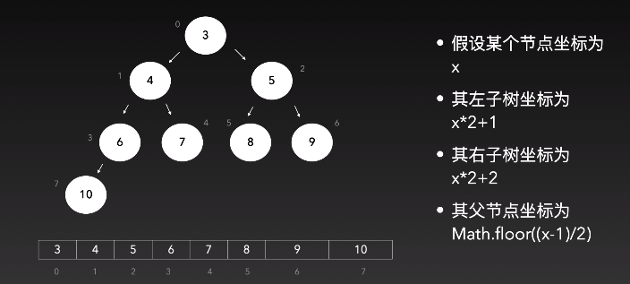
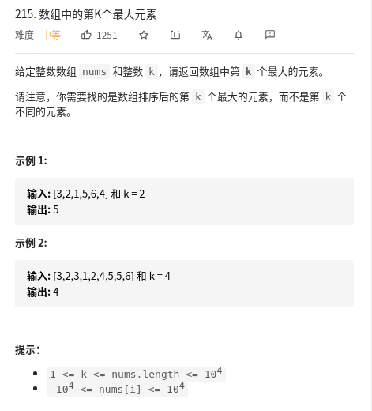

<!--
 * @Author: your name
 * @Date: 2021-08-30 14:51:40
 * @LastEditTime: 2021-08-31 19:29:07
 * @LastEditors: Please set LastEditors
 * @Description: In User Settings Edit
 * @FilePath: /CS-notes/C/algorithm/决战offer题解/堆排序/JS堆排序实现.md
-->

堆排序是一种原地、非稳定、时间复杂度nlogn的排序算法， 它借助一种数据结构- 堆

# 堆

首先堆是一种tree, 一种满足以下特征的树结构

- 堆是一个完全二叉树
- 堆中每个节点的值必须大于或者等于（小于或者等于）其左右子树的值（大顶堆，小顶堆）

# 如何实现一个堆
我们可以使用数组实现，因为相比链表无需存储左右指针、节约空间

- 假设某个节点坐标为x
- 其左子树坐标为x*2 +1
- 其右子树坐标为x*2 + 2
- 其父节点坐标为Math.floor((x-1)/2)

# 堆排序过程（以升序为例）
- 构建一个大顶堆， 取堆顶数字（也就是最大值）
- 再将剩下的数字构成一个大顶堆， 取堆顶数字（也就是剩下值当中的最大值）
- 重复以上操作，直到取完堆中的数字，最终得到一个升序的序列

# 例: LeetCode225

> 给定整数数组 nums 和整数 k，请返回数组中第 k 个最大的元素。

> 请注意，你需要找的是数组排序后的第 k 个最大的元素，而不是第 k 个不同的元素。

示例 1:

输入: [3,2,1,5,6,4] 和 k = 2
输出: 5
示例 2:

输入: [3,2,3,1,2,4,5,5,6] 和 k = 4
输出: 4

输入： [19, 97,1, 8,9,17] 和k=2

输出:  19

注意：

-  不能直接使用编程语言内置的排序算法
  

js实现堆排序

视频讲解：　https://leetcode-cn.com/problems/kth-largest-element-in-an-array/solution/jsji-chu-de-dui-pai-xu-shi-xian-by-huinuo/

