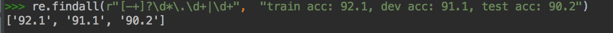
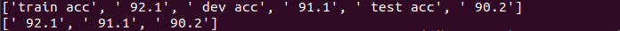

<!--
 * @Author: your name
 * @Date: 2021-02-05 16:57:05
 * @LastEditTime: 2021-02-05 17:56:47
 * @LastEditors: Please set LastEditors
 * @Description: In User Settings Edit
 * @FilePath: /C/algorithm/剑指offer题解/Q6从string中抽取数字/readme.md
-->
#  题目描述
此题与第二题类似. 我们在数据分析时候需要可视化分析，比如，结果log是:

`“train acc: 92.1, dev acc: 91.1, test acc: 90.2”`


对于画图来说，我们需要抽取出里面的92.1, 91.1以及90.2等值，那么应该怎么做呢?


# 解答

## 方法一：正则匹配实现

我们可以这么做！

```
e.findall(r"[-+]?\d*\.\d+|\d+",  “train acc: 92.1, dev acc: 91.1, test acc: 90.2”)

```
效果图如下：

于是我们抽取出了里面的值，可用于后续工作。

## 方法二: 遍历成数组，切片实现


```
import re
s = "train acc..."
res = [eval(i) for i in re.split(r’[:,]’, s)[1::2]]
print(res)
=========
[92.1, 91.1, 90.2]
```

```

str_copy =  "train acc: 92.1, dev acc: 91.1, test acc: 90.2"

# 以";"和","作为分割
# temp结果：　['train acc', ' 92.1', ' dev acc', ' 91.1', ' test acc', ' 90.2']

temp =  re.split(r'[:,]',str_copy)
# 从下标为1的元素（即a[1]为'92.1'开始），隔一个元素，读取一个元素。
arr = temp[1::2]

print(temp) # ['train acc', ' 92.1', ' dev acc', ' 91.1', ' test acc', ' 90.2']

print(arr) # [' 92.1', ' 91.1', ' 90.2']

```


### 代码详解
 > 数组切片[1::2]怎么理解?

python中数组切片

在数组a中，有三个地方可以设置参数a[①:②:③]。
- 位置①列表初始索引，默认为0
- 位置②列表结束索引，默认到最后一个元素（包含最后一个元素）
- 位置③为步长，默认为1
```
a = np.arange(1, 10)

print(a)  # [1 2 3 4 5 6 7 8 9]
print(a[::])  # [1 2 3 4 5 6 7 8 9]
print(a[0:-1:])  # [1 2 3 4 5 6 7 8]
print(a[0::])  # [1 2 3 4 5 6 7 8 9]
print(a[1::2])  # [2 4 6 8]

b = a[::-1]
print(b)  # [9 8 7 6 5 4 3 2 1]
c = a[::-2]
print(c)  # [9 7 5 3 1]
```

生成数据a：

```
a = np.arange(1, 10)
print(a)  # [1 2 3 4 5 6 7 8 9]
print(a[::])  # [1 2 3 4 5 6 7 8 9]
```

以上两个输出一样。

```
print(a[0:-1:])  # [1 2 3 4 5 6 7 8]
print(a[0::])    # [1 2 3 4 5 6 7 8 9]
```

位置③设为2时，从下标为1的元素（即a[1]为2开始），隔一个元素，读取一个元素。

```
print(a[1::2])  # [2 4 6 8]
```

位置③为负数时，从后向前读取数组中的元素，a[::-1]相当于将数组逆序。

```
b = a[::-1]
print(b)  # [9 8 7 6 5 4 3 2 1]
c = a[::-2]
print(c)  # [9 7 5 3 1]
```