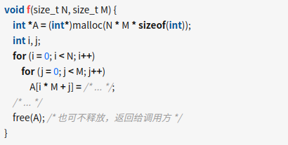

<!--
 * @Author: your name
 * @Date: 2021-10-25 17:43:17
 * @LastEditTime: 2021-10-25 18:07:39
 * @LastEditors: Please set LastEditors
 * @Description: In User Settings Edit
 * @FilePath: /数组与指针/c语言实现二维数组.md
-->
数组可以看作是一行连续的数据，只有一个下标，称为一维数组。在实际问题中有很多数据是二维的或多维的，因此C语言允许构造多维数组。多维数组元素有多个下标，以确定它在数组中的位置。

## 二维数组

```
dataType arrayName[length1][length2];
```
- dataType 为数据类型，
- arrayName 为数组名，
- length1 为第一维下标的长度，
- length2 为第二维下标的长度。

```

int a[3][4];
```

定义了一个 3 行 4 列的二维数组，共有 3×4=12 个元素，数组名为 a，即：

```

a[0][0], a[0][1], a[0][2], a[0][3]
a[1][0], a[1][1], a[1][2], a[1][3]
a[2][0], a[2][1], a[2][2], a[2][3]
```

二维数组在概念上是二维的，但在内存中是连续存放的；换句话说，二维数组的各个元素是相互挨着的，彼此之间没有缝隙。那么，如何在线性内存中存放二维数组呢？有两种方式：

- 一种是按行排列， 即放完一行之后再放入第二行；
- 另一种是按列排列， 即放完一列之后再放入第二列。

`在C语言中，二维数组是按行排列的。也就是先存放 a[0] 行`，再存放 a[1] 行，最后存放 a[2] 行；每行中的 4 个元素也是依次存放。数组 a 为 int 类型，每个元素占用 4 个字节，整个数组共占用 4×(3×4)=48 个字节。

你可以这样认为，二维数组是由多个长度相同的一维数组构成的。

## 固定大小二维数组

如果是固定大小的数组，在 C 语言中用二维数组是最简单高效的：

```
const size_t N = 100, M = 100;
int A[N][M];
```

## 动态的二维数组（矩形数组）

对于动态的二维数组（矩形数组），C 语言需要 C99 的可变长数组（VLA）才可以：

```
对于动态的二维数组（矩形数组），C 语言需要 C99 的可变长数组（VLA）才可以：

```

而且 VLA 必须为局部变量，生命周期为作用域之内。

若编译／运行环境不容许使用 VLA，或者要控制生命周期的话

C 语言并没有在语言层面提供动态二维数组的功能。一般做法是自行分配一块内存，使用时自行计算下标：




## 锯齿形数组（jagged array）
如果不是矩形数组，而是锯齿形数组（jagged array）

才会考虑使用二级指针（如int** A）

用二级指针的「好处」是下标不用自行计算（可写成A[i][j]）。

但对矩形数组也用二级指针的话，会有不必要的内存（存储指针的数组）和运行时开销（每次访问元素多一次寻址）。

另外，如果存储的数据是稀疏的（sparse），也会采用专门的数据结构。