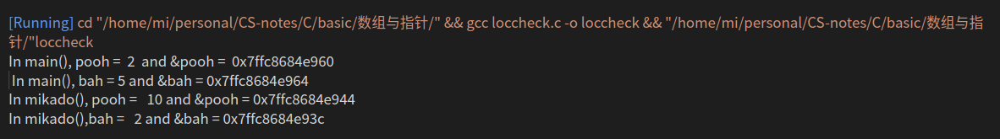

<!--
 * @Author: your name
 * @Date: 2020-12-07 11:38:35
 * @LastEditTime: 2020-12-21 16:14:49
 * @LastEditors: Please set LastEditors
 * @Description: In User Settings Edit
 * @FilePath: /CS-notes/C/basic/数组与指针/readme.md
-->
# printf格式化输出
printf函数(还有它的同类fprintf和sprintf)提供了一种打印信息的方式，这种方式对格式化细节有相当大的控制能力
# 数组 & 指针
在C语言中我们能够用数组表示法引用指针
我们也能用指针表示法引用数组

## &运算符
一元＆运算符给出变量的存储地址.
- 如果pooh是变量名
- &pooh就是变量的地址

可以把地址看作是变量在内存中的位置
`loccheck.c    查看变量被存储在何处`

```c
/*
 * @Author: AlexZ33
 * @Date: 2020-12-07 
 * @LastEditTime: 2020-12-07 
 * @LastEditors: Please set LastEditors
 * @Description: 讲解&运算符
 *  查看变量被存储在何处
 * @FilePath: /C/basic/数组与指针/&.c
 * @Reference 《C Primer Plus》第六版
 */

 #include<stdio.h>
 void mikado (int);   /* 函数原型*/
 int main(void) 
 {
     int pooh  =  2,  bah  =  5;  /*main()的局部变量*/

     printf("In main(), pooh =  %d  and &pooh =  %p \n ",  pooh,  &pooh);
     printf("In main(), bah = %d and &bah = %p\n", bah, &bah);
     mikado(pooh);

     return 0;
 }

 void mikado(int bah)  /* 定义函数*/
 {
     int pooh = 10; /* mikado() 的局部变量*/

     printf("In mikado(), pooh =  % d and &pooh = %p\n", pooh, &pooh );
     printf("In mikado(),bah =  % d and &bah = %p\n", bah, &bah );

 }

```

输出

```
In main(), pooh =  2  and &pooh =  0x7ffc8684e960 
 In main(), bah = 5 and &bah = 0x7ffc8684e964
In mikado(), pooh =   10 and &pooh = 0x7ffc8684e944
In mikado(),bah =   2 and &bah = 0x7ffc8684e93c
```



0x7ffc8684e960　这种是１６进制数，它表示储存地址。　pc地址一般是１６进制表示，我们这里使用ANSIC的％p格式打印地址

- 　每个１６进制数对应４个位，该例显示１２个１６进制数，对应４８位地址
- 　我们看到输出结果，两个pooh的地址不同，两个bah的地址也不同. 因此计算机把他们看成４个独立的变量
- 函数调用mikado(pooh)把实际参数(main()中的pooh)的值(2)传递给形式参数(mikado()中的bah)。　注意，这种传递只传递了值，涉及两个变量(main()中的pooh和mikado()中的bah)并没有改变
- C语言中，每个函数有自己的变量，变量在自己的函数作用域内生效。如这里给函数mikado　内pooh新赋值，并不影响main函数内的pooh值

## 