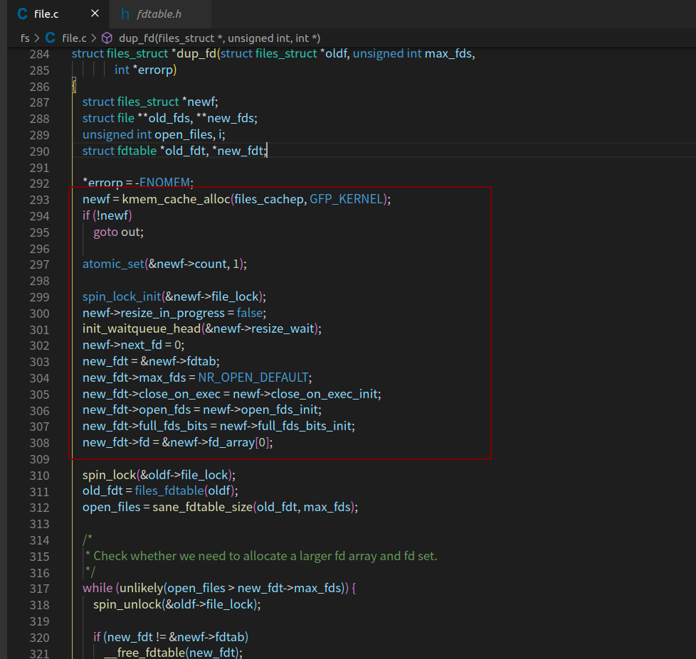

# Linux中的文件
文件I/O是操作系统不可或缺的部分，也是实现数据持久化的手段。对于Linux来说，其“一切皆是文件”的思想，更是突出了文件在Linux内核中的重要地位

## 1. 文件、文件描述符和文件表

- Linux内核将一切视为文件，那么Linux的文件是什么呢？其既可以是事实上的真正的物理文件，也
可以是设备、管道，甚至还可以是一块内存。狭义的文件是指文件系统中的物理文件，而广义的文件
则可以是Linux管理的所有对象。这些广义的文件利用VFS机制，以文件系统的形式挂载在Linux内核
中，对外提供一致的文件操作接口。
- 从数值上看，文件描述符是一个非负整数，其本质就是一个句柄，所以也可以认为文件描述符就
是一个文件句柄。那么何为句柄呢？一切对于用户透明的返回值，即可视为句柄。用户空间利用文件描述符与内核进行交互；而内核拿到文件描述符后，可以通过它得到用于管理文件的真正的数据结构。

- 使用文件描述符即句柄，有两个好处：一是增加了安全性，句柄类型对用户完全透明，用户无法通过任何hacking的方式，更改句柄对应的内部结果，比如Linux内核的文件描述符，只有内核才能通过该值得到对应的文件结构；二是增加了可扩展性，用户的代码只依赖于句柄的值，这样实际结构的类型就可以随时发生变化，与句柄的映射关系也可以随时改变，这些变化都不会影响任何现有的用户代
码。
- Linux的每个进程都会维护一个文件表，以便维护该进程打开文件的信息，包括打开的文件个数、每个打开文件的偏移量等信息。
## 2. 内核文件表的实现

内核中进程对应的结构是task_struct，进程的文件表保存在task_struct->files中。其结构代码如下所示:

源码地址: https://github.com/torvalds/linux/blob/master/include/linux/fdtable.h

```c

/*https://github.com/torvalds/linux/blob/master/include/linux/fdtable.h
 * Open file table structure
 */
struct files_struct {
  /*
   * read mostly part
   */

  /* count 为文件表files_struct的引用计数*/
	atomic_t count;
	bool resize_in_progress;
	wait_queue_head_t resize_wait;
   
   /*文件描述符表*/
   /* 为什么两个fdtable呢？　这是内核的一种优化策略, fdt为指针，而fdtab为普通变量，一般情况下，　fdt是指向fdtab的，当需要它时候，才会真正动态申请内存，因为默认大小的文件表足以应付大多数情况，因此这样就可以避免频繁的内存申请。　这也是内核的常用技巧之一，在创建时，使用普通的变量或者数组，然后让指针指向它，　作为默认情况使用，　只有当进程使用量超过默认值时候，才会动态申请内存*/
	struct fdtable __rcu *fdt;
	struct fdtable fdtab;
  /*
   * written part on a separate cache line in SMP
   */
  /*使用____cacheline_aligned_in_smp可以保证file_lock是以cache line 对齐的，避免了false sharing */
	spinlock_t file_lock ____cacheline_aligned_in_smp;
    /*适用于查找下一个空闲的fd*/
	unsigned int next_fd;
    /*保存执行exec需要关闭的文件描述符的位图*/
	unsigned long close_on_exec_init[1];
    /*保存打开的文件描述符的位图*/
	unsigned long open_fds_init[1];
	unsigned long full_fds_bits_init[1];
    /*fd_array为一个固定大小的file结构数组, struct file是内核用于文件管理的结构, 这里使用默认大小数组，　就是为了可以涵盖大多数情况, 避免动态分配*/
	struct file __rcu * fd_array[NR_OPEN_DEFAULT];
};
```
下面看看files_struct是如何使用默认的fdtab和fd_array的，init是Linux的第一个进程，它的文件表是一个全局变量，代码如下：


init_files.fdt和init_files.fdtab.fd都分别指向了自己已有的成员变量，并以此作为一个默认值。后面的进程都是从init进程fork出来的。fork的时候会调用dup_fd，而在dup_fd中其代码结构如下：



初始化new_fdt，同样是为了让new_fdtnew_fdt->fd指向其本身的成员变量fdtab和fd_array。

因此，初始状态下，files_struct、fdtable和files的关系如图

## 3.  打开文件
open在手册中有两个函数原型

- 手册地址：https://man7.org/linux/man-pages/man2/open.2.html


这样的函数原型有些违背了我们的直觉。**C语言是不支持函数重载的**，为什么open的系统调用可以有两个这样的open原型呢？内核绝对不可能为这个功能创建两个系统调用。

在Linux内核中，实际上只提供了一个系统调用，对应的是上述两个函数原型中的第二个。那么open有两个函数原型又是怎么回事呢？

**当我们调用open函数时，实际上调用的是glibc封装的函数，然后由glibc通过自陷指令，进行真正的系统调用。** 也就是说，所有的系统调用都要先经过glibc才会进入操作系统。这样的话，实际上是glibc提供了一个变参函数open来满足两个函数原型，然后通过glibc的变参函数open实现真正的系统调用来调用原型二。

可以通过一个程序`open.c`来验证我们的猜想，代码如下：

```c
/*
 * @Author:     AlexZ33
 * @Date: 2020-12-21 
 * @LastEditTime: 2020-12-21 
 * @LastEditors: Please set LastEditors
 * @Description: In User Settings Edit
 * @FilePath: /CS-notes/C/basic/文件IO/open.c
 */

#include <sys/types.h>
#include <sys/stat.h>
#include <fcntl.h>
#include <unistd.h>
int main(void)
{
    int fd = open("test_open.txt", O_CREAT, 0644, "test");
    close(fd);
    return 0;
}

```
在这个程序中，调用open的时候，传入了4个参数，如果open不是变参函数，就会报错，如“toomany arguments to function‘open’”。但是请看下面的编译输出：

```bash
#gcc -g -Wall 2_2_1_test_open.c
# 
```


没有任何的警告和错误。这就证实了我们的猜想，open是glibc的一个变参函数。fcntl.h中open函数的声明也确定了这点：

```c
extern int open (__const char *__file, int __oflag, ...) __nonnull ((1));
```

### 3.1  open()
```c
#include <sys/types.h>
#include <sys/stat.h>
#include <fcntl.h>
int open(const char *pathname, int flags);
int open(const char *pathname, int flags, mode_t mode);

```
open参数:

- pathname: 表示要打开的文件路径
- flags: 用于指示打开文件的选项。
- mode：只在创建文件时需要，用于指定所创建文件的权限位（还要受到umask环境变量的影
响）。

`flags` 用于指定文件的打开/创建模式，这个参数可由以下三个互斥的常量（定义于 fcntl.h）通过逻辑或（|）连接：

```
O_RDONLY       只读模式 
O_WRONLY      只写模式 
O_RDWR          读写模式
```
这三个选项必须有且只能有一个被指定。为什么O_RDWR！=O_RDONLY|O_WRONLY呢？Linux环境中，O_RDONLY被定义为0，O_WRONLY被定义为1，而O_RDWR却被定义为2。

之所以有这样违反常规的设计遗留至今，就是为了兼容以前的程序。

其他可选常量


以下用于同步输入输出


`mode` 和 fopen() 函数的 `mode `参数相同。
需要注意的是，当 `flags `为 O_CREAT 或 O_TMPFILE 时，必须提供 `mode` 参数；否则` mode `参数将不起作用。


**返回值**
open() 的返回值是一个 int 类型的文件描述符，打开失败返回 -1。

**区别**
- 前者（open）属于低级IO，后者（fopen）是高级IO。
- 前者返回一个文件描述符，后者返回一个文件指针。
- 前者无缓冲，后者有缓冲。
- 前者与 read, write 等配合使用， 后者与 fread, fwrite等配合使用。
- 后者是在前者的基础上扩充而来的，在大多数情况下，用后者。
- fopen() 是 C 标准库中的函数，而 open() 是 Linux 中的系统调用函数。

> 注意： 当我们调用open函数时，实际上调用的是glibc封装的函数，然后由glibc通过自陷指令，进行真
正的系统调用。也就是说，所有的系统调用都要先经过glibc才会进入操作系统。

### 3.2 fopen()

```c
#include <stdio.h>
FILE *fopen(const char *path, const char *mode);
```
`mode` 指定文件的打开模式：

- r：只读方式打开一个文本文件（该文件必须存在）
- r+：可读可写方式打开一个文本文件（该文件必须存在）
- w：只写方式打开一个文本文件（若文件存在则文件长度清为0，即该文件内容会消失。若文件不存在则建立该文件）
- w+：可读可写方式创建一个文本文件（若文件存在则文件长度清为零，即该文件内容会消失。若文件不存在则建立该文件）
- a：追加方式打开一个文本文件（若文件不存在，则会建立该文件，如果文件存在，写入的数据会被加到文件尾，即文件原先的内容会被保留。（EOF符保留））
- a+：可读可写追加方式打开一个文本文件（若文件不存在，则会建立该文件，如果文件存在，写入的数据会被加到文件尾后，即文件原先的内容会被保留。 （原来的EOF符不保留））
a 和 a+ 的区别：a 不能读，a+ 可以读

- rb：只读方式打开一个二进制文件（使用法则同r）
- rb+：可读可写方式打开一个二进制文件（使用法则同r+）
- wb：只写方式打开一个二进制文件（使用法则同w）
- wb+：可读可写方式生成一个二进制文件（使用法则同w+）
- ab：追加方式打开一个二进制文件（使用法则同a）
- ab+：可读可写方式追加一个二进制文件（使用法则同a+）

**返回值**
fopen() 的返回值是一个 FILE 类型的指针，若打开失败则返回 NULL。

### 3.3 open源码跟踪(选读)

我们经常这样描述“打开一个文件”，那么这个所谓的“打开”，究竟“打开”了什么？内核在这个过程中，又做了哪些事情呢？这一切将通过分析内核源码来得到答案。

源码地址：https://github.com/torvalds/linux/blob/master/fs/open.c　

跟踪内核`linux/fs/open.c`  open源码open->do_sys_open，代码如下：


```c
static long do_sys_openat2(int dfd, const char __user *filename,
			   struct open_how *how)
{
	struct open_flags op; 
	int fd = build_open_flags(how, &op);
	struct filename *tmp;

	if (fd)
		return fd;
　/*将用户空间的文件名参数复制到内核空间*/
	tmp = getname(filename);
	if (IS_ERR(tmp))
		return PTR_ERR(tmp);
　/*未出错则申请新的文件描述符*/
	fd = get_unused_fd_flags(how->flags);
	if (fd >= 0) {
        /*  申请新的文件管理结构 */
		struct file *f = do_filp_open(dfd, tmp, &op);
		if (IS_ERR(f)) {
			put_unused_fd(fd);
			fd = PTR_ERR(f);
		} else {
            /* 产生文件打开的通知事件*/
			fsnotify_open(f); 
            /* 将文件描述符fd 与文件管理结构file　对应起来，　即安装*/
			fd_install(fd, f);
		}
	}
	putname(tmp);
	return fd;
}

long do_sys_open(int dfd, const char __user *filename, int flags, umode_t mode)
{
	struct open_how how = build_open_how(flags, mode);
	return do_sys_openat2(dfd, filename, &how);
}

```
从do_sys_open可以看出，打开文件时，内核主要消耗了两种资源：
- 文件描述符
- 内核管理文件结构file。

#### **如何选择文件描述符?**

根据POSIX标准，当获取一个新的文件描述符时，要返回最低的未使用的文件描述符。
Linux是如何实现这一标准的呢？

在Linux中，通过do_sys_open->get_unused_fd_flags->alloc_fd（0，（flags））来选择文件描述符，代码如下：

- 源码地址: https://github.com/torvalds/linux/blob/master/fs/file.c


```c
/*
 * allocate a file descriptor, mark it busy.
 */
static int alloc_fd(unsigned start, unsigned end, unsigned flags)
{
	struct files_struct *files = current->files;
	unsigned int fd;
	int error;
	struct fdtable *fdt;
   /* files 为进程的文件表，　下面需要修改文件表，所以需要先锁文件表*/
	spin_lock(&files->file_lock);
repeat:
　/* 得到文件描述符表*/
	fdt = files_fdtable(files);
    /* 从start开始，查找未用的文件描述符，在打开文件时，　start为０*/
	fd = start;
    /* files -> next_fd为上一次成功找到的fd的下一个描述符，使用next_fd, 可以快速找到未用的文件描述符*/
	if (fd < files->next_fd)
		fd = files->next_fd;
　/*当小于当前文件表支持的最大文件描述符个数时，利用位图找到未使用的文件描述符, 如果大于max_fds怎么办? 如果大于当前支持的最大文件描述符，那肯定是未用的，就不需要用位图来确认了*/
	if (fd < fdt->max_fds)
		fd = find_next_fd(fdt, fd);

	/*
	 * N.B. For clone tasks sharing a files structure, this test
	 * will limit the total number of files that can be opened.
	 */
	error = -EMFILE;
	if (fd >= end)
		goto out;
　/*expand_files用于在必要时候扩展文件表, 何时是必要时候呢？　比如当文件描述符已经超过了当前文件表支持的最大值的时候*/
	error = expand_files(files, fd);
	if (error < 0)
		goto out;

	/*
	 * If we needed to expand the fs array we
	 * might have blocked - try again.
	 */
	if (error)
		goto repeat;
　/* 只有在start小于next_fd时，才需要更新next_fd,　以尽量保证文件描述的连续性*/
	if (start <= files->next_fd)
		files->next_fd = fd + 1;

	__set_open_fd(fd, fdt);
	if (flags & O_CLOEXEC)
		__set_close_on_exec(fd, fdt);
	else
		__clear_close_on_exec(fd, fdt);
	error = fd;
#if 1
	/* Sanity check */
	if (rcu_access_pointer(fdt->fd[fd]) != NULL) {
		printk(KERN_WARNING "alloc_fd: slot %d not NULL!\n", fd);
		rcu_assign_pointer(fdt->fd[fd], NULL);
	}
#endif

out:
	spin_unlock(&files->file_lock);
	return error;
}
```

#### **文件描述符fd与文件管理结构file**

前文已经说过，内核使用fd_install将文件管理结构file与fd组合起来，具体操作请看如下代码：

- 代码地址： https://github.com/torvalds/linux/blob/master/fs/file.c


```c

void fd_install(unsigned int fd, struct file *file)
{
	struct files_struct *files = current->files;
	struct fdtable *fdt;

	rcu_read_lock_sched();

	if (unlikely(files->resize_in_progress)) {
		rcu_read_unlock_sched();
		spin_lock(&files->file_lock);
        /* 得到文件描述符表*/
		fdt = files_fdtable(files);
		BUG_ON(fdt->fd[fd] != NULL);
        /* 将文件描述符表中的file类型的指针数组中对应fd的项指向file，　这样文件描述符fd与file就建立了对应关系*/
		rcu_assign_pointer(fdt->fd[fd], file);
		spin_unlock(&files->file_lock);
		return;
	}
	/* coupled with smp_wmb() in expand_fdtable() */
	smp_rmb();
	` fdt = rcu_dereference_sched(files->fdt);
	BUG_ON(fdt->fd[fd] != NULL);
	rcu_assign_pointer(fdt->fd[fd], file);
	rcu_read_unlock_sched();
}
```

当用户使用fd与内核交互时，内核可以用fd从fdt->fd[fd]中得到内部管理文件的结构struct file。


# 参考
- 《linux环境编译: 从应用到内核》
- https://man7.org/linux/man-pages/man2/open.2.html
- https://man7.org/linux/man-pages/man3/fopen.3p.html
