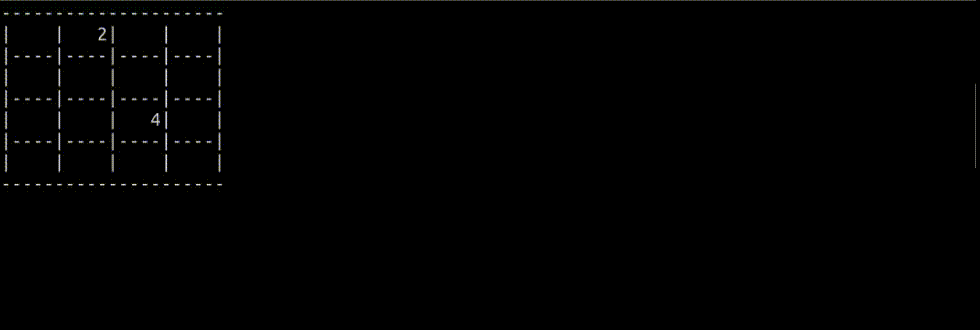
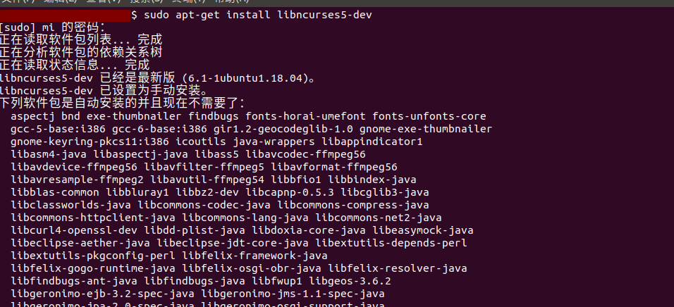

<!--
 * @Author: your name
 * @Date: 2020-12-03 22:22:14
 * @LastEditTime: 2020-12-03 22:44:28
 * @LastEditors: Please set LastEditors
 * @Description: In User Settings Edit
 * @FilePath: /C/game/2048/2048game.md
-->
# C语言实现2048game

面向人群: 零基础或者初学者

难度: 简单， 属于c语言基础课程

## 重要说明
我们尽力保证课程内容的质量以及学习难度的合理性，但即使如此，真正决定课程效果的，还是你的每一次思考和实践。

课程多数题目的解决方案都不是唯一的，这和我们在实际工作中的情况也是一致的。因此，我们的要求功能的实现，更是要多去思考不同的解决方案，评估不同方案的优劣，然后使用在该场景下最优雅的方式去实现。所以，我们列出的参考资料未必是实现需求所必须的。有的时候，实现题目的要求很简单，甚至参考资料里就有，但是背后的思考和亲手去实践却是任务最关键的一部分。在学习这些资料时，要多思考，多提问，多质疑。相信通过和小伙伴们的交流，能让你的学习事半功倍。

## 1.1 任务介绍

预期效果:


## 1.2知识点
- C 语言语法
- 数据结构的知识
- 游戏设计与实现思路
- 字符绘图
- 屏幕绘图库ncurses的使用

ubuntu 安装 ncurses
```
sudo apt-get install libncurses5-dev
```


## 1.3 环境

- linux系统(ubuntu18.04)/ windows系统可以打开ubuntu子系统
- gcc编译器
- Linux 命令行终端，打开后会进入 Bash 环境，可以用来执行 Linux 命令
- vscode编辑器, 关于用vscode编写c语言的环境。可以看这篇文章：　
  - VSCode配置gcc编译工具：　https://blog.csdn.net/wangqingchuan92/article/details/108974662

## 1.4 原理

要实现 2048 游戏目前有两个关键点：

- 在满足条件情况下消除方块
- 允许在游戏主界面（16 宫格）中任意一格输出数据
其中第二点借助 ncurses 库可以较容易实现，但是第一点要稍微麻烦些。第一点的实现思路是，我们创建一个与游戏地图相同维数的数组矩阵，通过数组矩阵来维护 2048 游戏中每个格子的数据与状态，从而玩家的移动操作都可以映射为对数组矩阵的操作。


