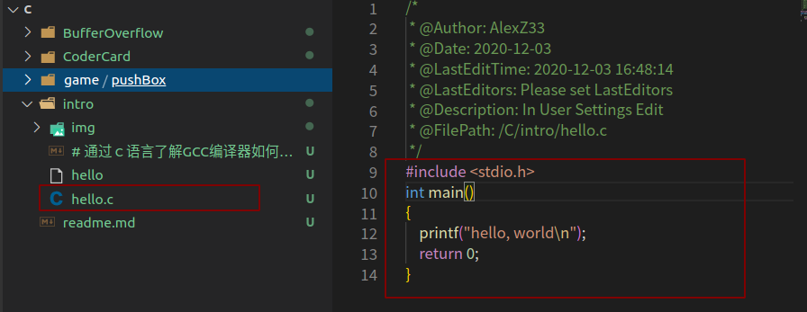
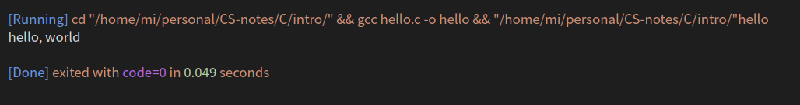
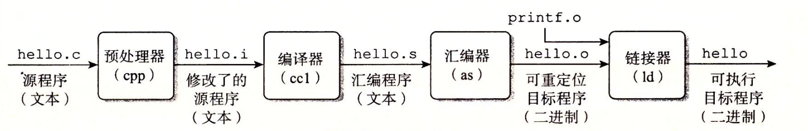

<!--
 * @Author: your name
 * @Date: 2020-12-03 16:33:56
 * @LastEditTime: 2020-12-03 17:45:23
 * @LastEditors: Please set LastEditors
 * @Description: In User Settings Edit
 * @FilePath: /C/intro/# 通过ｃ语言了解GCC编译器如何工作的.md
-->


# 通过ｃ语言了解GCC编译器如何工作的

## 比特

下面是c语言初学必看的打印helloworld

```
#include <stdio.h>
int main()
{
	printf("hello, world\n");
	return 0;
}
```

程序员（我们）通过编辑器创建并保存的文本文件，文件名是` hello.c`



源程序实际上就是一个由值 0 和 1 组成的位（又称为比特）序列，8 个位被组织成一组，称为字节。每个字节表示程序中的某些文本字符。

大部分的现代计算机系统都使用 ASCII 标准来表示文本字符，这种方式实际上就是用一个唯一的单字节大小的✦整数值✦来表示每个字符。比如如下:

<b>hello.c 程序的 ASCII 码表示</b>


hello.c 程序是以字节序列的方式储存在文件中的。每个字节都有一个整数值，对应于某些字符。例如，第一个字节的整数值是 35，它对应的就是字符 “#”。第二个字节的整数值为 105，它对应的字符是 ‘i’

> 注意，每个文本行都是以一个看不见的换行符 ‘\n’ 来结束的，它所对应的整数值为 10。像 hello.c 这样只由 ASCII 字符构成的文件称为文本文件，所有其他文件都称为二进制文件。


hello.c 的表示方法说明了一个基本思想∶系统中所有的信息——包括磁盘文件、内存中的程序、内存中存放的用户数据以及网络上传送的数据，都是由一串比特表示的。区分不同数据对象的唯一方法是我们读到这些数据对象时的上下文。比如，在不同的上下文中，一个同样的字节序列可能表示一个整数、浮点数、字符串或者机器指令。 作为程序员，我们需要了解数字的机器表示方式，因为它们与实际的整数和实数是不同的。它们是对真值的有限近似值，有时候会有意想不到的行为表现。




## ＧＣＣ编译器编译过程

在系统上运行 hello.c 程序，每条 C 语句都必须被其他程序转化为一系列的`低级机器语言指令`。然后这些指令按照一种称为可执行目标程序的格式打好包，并以二进制磁盘文件的形式存放起来。目标程序也称为可执行目标文件。



看上面这张图，是源文件`hello.c`被编译成计算机可执行的二进制文件的过程（这里使用的gcc编译器，unix系统）

在 Unix 系统上，从源文件到目标文件的转化是由编译器驱动程序完成的∶
```
linux> gcc -o hello hello.c
```

在这里，GCC 编译器驱动程序读取源程序文件 hello.c，并把它翻译成一个可执行目标文件 hello。这个翻译过程可分为四个阶段完成，如图 1-3 所示。执行这四个阶段的程序（预处理器、编译器、汇编器和链接器）一起构成了编译系统（compilation system）。

> 注意，如果你使用的是windows系统，我们的这批文章可以帮你在windows上使用gcc编译器

- <b>预处理阶段</b>。预处理器（cpp）根据以字符 # 开头的命令，修改原始的 C 程序。比如 hello.c 中第 1 行的`#include <stdio.h>`命令告诉预处理器读取系统头文件 stdio.h 的内容，并把它直接插入程序文本中。结果就得到了另一个 C 程序，通常是以 `.i `作为文件扩展名。 
- <b>编译阶段</b>。编译器（ccl）将文本文件 hello.i 翻译成文本文件 hello.s，它包含一个汇编语言程序。该程序包含函数 main 的定义，如下所示∶


 定义中 2～7 行的每条语句都以一种文本格式描述了一条低级机器语言指令。汇编语言是非常有用的，因为它为不同高级语言的不同编译器提供了通用的输出语言。例如，C编译器和 Fortran 编译器产生的输出文件用的都是一样的汇编语言。

- <b> 汇编阶段</b>。接下来，汇编器（as）将 hello.s 翻译成机器语言指令，把这些指令打包成一种叫做可重定位目标程序（relocatable object program）的格式，并将结果保存在目标文件 hello.o 中。hello.o 文件是一个二进制文件，它包含的 17 个字节是函数 main 的指令编码。如果我们在文本编辑器中打开 hello.o文件，将看到一堆乱码。
- <b> 链接阶段</b>。请注意，hello 程序调用了 printf 函数，它是每个 C 编译器都提供的标准 C 库中的一个函数。printf 函数存在于一个名为 printf.o 的单独的预编译好了的目标文件中，而这个文件必须以某种方式合并到我们的 hello.o 程序中。链接器（ld）就负责处理这种合并。结果就得到 hello 文件，它是一个可执行目标文件（或者简称为可执行文件），可以被加载到内存中，由系统执行。