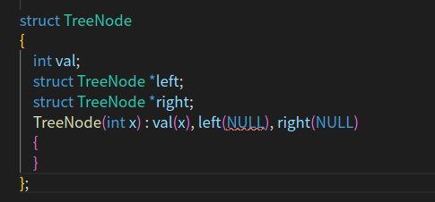
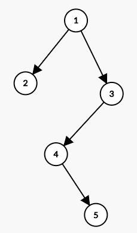

<!--
 * @Author: your name
 * @Date: 2021-01-29 14:11:04
 * @LastEditTime: 2021-02-04 11:15:49
 * @LastEditors: Please set LastEditors
 * @Description: In User Settings Edit
 * @FilePath: /CS-notes/C/数据结构/树/readme.md
-->

内容衔接上一章 数据结构与算法:常见排序算法
内容提要
---------

- 什么是树
  - 为什么使用树

- 二叉树
- 二叉查找树
- 红黑树
- Ｂ、Ｂ＋树
- 堆
- 伸展树

# 树 （TreeNode）

可以点击链接感受下笔者用d3.js画的tree

https://codepen.io/AlexZ33/pen/BPGeWN

`树` 是计算机科学中经常用到的一种数据结构。

  - 树是一种非线性的数据结构，以分层的方式存储数据。
- 树被用来存储具有层级关系的数据，比如文件系统中的文件
- 数还被用来存储有序列表

TreeNode是经典的二叉树节点，在数据的序列化和反序列按照层遍历来处理的。

> 以上二叉树会被序列化为 {1,2,3,#,#,4,#,#,5}
> 1：root节点1，是第一层
> 2,3：然后第二层是2，3
> #,#,4,#：第三层分别是2节点的两个孩子节点空，用#来表示，然后3节点的左孩子为>4，右孩子节点为#
> #,5：第四层4节点的左孩子是空，右孩子为5
最后一层5节点的两个空孩子不便利 

<b>选择树而不是那些基本的数据结构，是因为：</b>

- 二叉树上进行查找特别快（而在链表上查找每次基本就是遍历，查找速度很慢）
- 二叉树添加或删除元素也很快（而对数组执行添加或删除操作则不是这样）

------

二叉树的建立与遍历（C语言实现）

1：二叉树结点的定义：

struct Node
	{
		int data;
		struct Node *pleft;
		struct Node *pright;
	}Node;
2：二叉树创造一个结点的函数，返回值是指向该节点的指针：

struct Node *createnode(int value)
	{
		struct Node *pnode = (struct Node *)malloc(sizeof(struct Node));
		pnode->data = value;
		pnode->pleft = pnode->pright = NULL;
		return pnode;
	}	
3：二叉树插入结点的函数：

struct Node *addnode(int value, struct Node *pnode)
	{
		if(pnode == NULL)
			return createnode(value);

		if(value == pnode->data)
		{
			return pnode;
		}

		if(value < pnode->data)
		{
			if(pnode->pleft == NULL)
			{
				pnode->pleft = createnode(value);
				return pnode->pleft;
			}
			else
			{
				return addnode(value, pnode->pleft);
			}
		}
		else
		{
			if(pnode->pright == NULL)
			{
				pnode->pright = createnode(value);
				return pnode->pright;
			}
			else
			{
				return addnode(value, pnode->pright);
			}

		}
	}
4：二叉树的遍历（三种，此处为中序遍历），用到了递归：

void listnodes(struct Node *pnode)
{
	if(pnode != NULL)
	{
		listnodes(pnode->pleft);
		printf("%d\n", pnode->data);
		listnodes(pnode->pright);
	}
}
5：求二叉树的深度，递归：

int Treeheight(struct Node *pnode)
{
	int LD, RD;
	if(pnode == NULL)
	{
		return 0;
	}
	else
	{
		LD = Treeheight(pnode->pleft);
		RD = Treeheight(pnode->pright);
		return (LD >= RD? LD:RD) + 1;
	}
}
6：主函数：

int main(void)
{
	int newvalue = 0;
	struct Node *proot = NULL;
	char answer = 'n';
	do
	{
		printf("Enter the node value:\n");
		scanf("%d", &newvalue);
		if(proot == NULL)
		{
			proot = createnode(newvalue);
		}
		else
		{
			addnode(newvalue, proot);
		}
		printf("\nDo you want to enter another (y or n)? ");
		scanf(" %c", &answer);
	} while(tolower(answer) == 'y');

	listnodes(proot);
	printf("\nThe height of tree is %d!", Treeheight(proot));

	return 0;
}
7：需要添加的头文件：

#include <stdio.h>
#include <stdlib.h>
#include <ctype.h>
