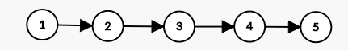

<!--
 * @Author: your name
 * @Date: 2021-02-03 17:05:42
 * @LastEditTime: 2021-02-03 17:14:58
 * @LastEditors: Please set LastEditors
 * @Description: In User Settings Edit
 * @FilePath: /CS-notes/C/数据结构/链表/readme.md
-->

```
struct ListNode
{
    int val;
    struct ListNode *next;
    ListNode(int x) : val(x), left(NULL)
}
```

单链表结构，格式{0,1,2,3,4}，每个链表节点一个数字，从头到尾排布，通过,分开。