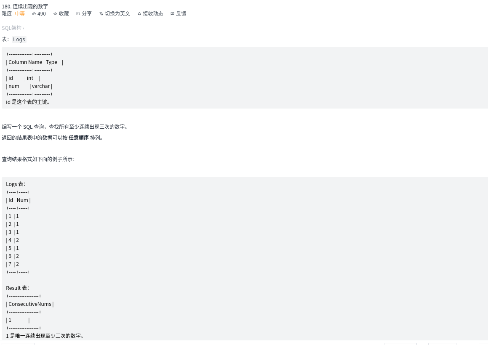
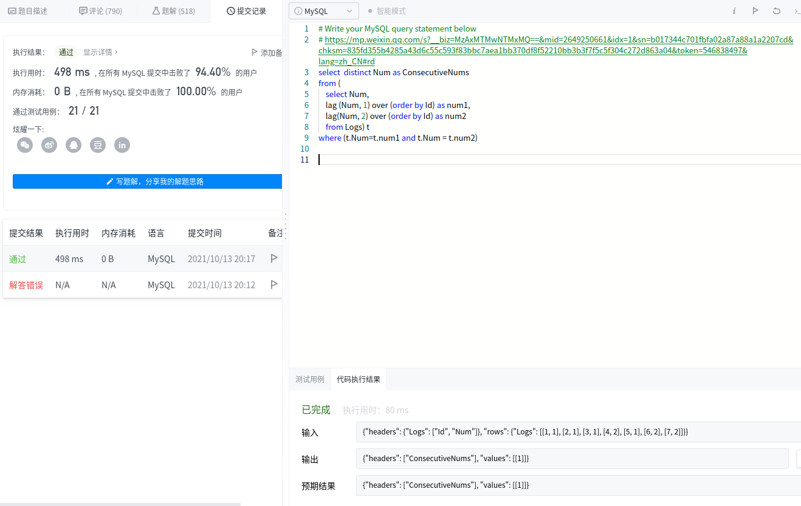
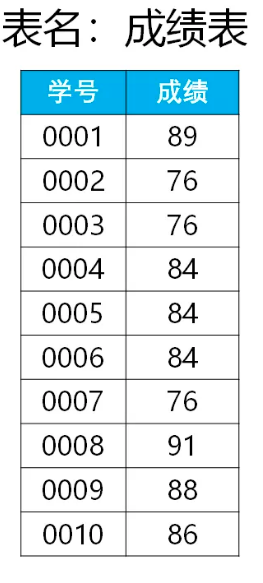

#! https://zhuanlan.zhihu.com/p/421145938
<!--
 * @Author: your name
 * @Date: 2021-10-13 19:44:48
 * @LastEditTime: 2021-10-13 20:29:58
 * @LastEditors: Please set LastEditors
 * @Description: In User Settings Edit
 * @FilePath: /algorithm/leetcode/180. 连续出现的数字/readme.md
-->
# 【SQL】leetcode 180. 连续出现的数字 

属于连续出现N次的问题
# 题目



 本题考察的是连续出现，会有同学忽略“连续”二字
- 考察对自关联的灵活应用
- 从题目连续3次相等，判断出“相等”和“连续”这2个条件
# 题解

这是典型的连续出现N次问题, 要用到窗口函数，

窗口函数lag或者lead
- 向上窗口函数lead：取出字段名所在的列，向上N行的数据，作为独立的列
- 向下窗口函数lag：取出字段名所在的列，向下N行的数据，作为独立的列

```sql
lag(字段名,N,默认值) over(partion by …order by …)

lead(字段名,N,默认值) over(partion by …order by …)

# 默认值是指，当向上N行或者向下N行值时，如果已经超出了表行和列的范围时，会将这个默认值作为函数的返回值，若没有指定默认值，则返回Null。
```
结果
```sql
select  distinct Num as ConsecutiveNums
from (
    select Num,
    lag (Num, 1) over (order by Id) as num1, 
    lag(Num, 2) over (order by Id) as num2
    from Logs) t
where (t.Num=t.num1 and t.Num = t.num2)    

```


模板

下面是学生的成绩表（表名score，列名：学号、成绩），使用SQL查找所有至少连续出现3次的成绩。




```

select distinct 成绩
from(
select 成绩,
lag(成绩,1) over(order by 学号) as 成绩1,
lag(成绩,2) over(order by 学号) as 成绩2
from 成绩表)t
where (t.成绩 = t.成绩1 and t.成绩 = t.成绩2);
```

## 拓展阅读
[如何找出连续出现N次的内容？](https://mp.weixin.qq.com/s?__biz=MzAxMTMwNTMxMQ==&mid=2649250661&idx=1&sn=b017344c701fbfa02a87a88a1a2207cd&chksm=835fd355b4285a43d6c55c593f83bbc7aea1bb370df8f52210bb3b3f7f5c5f304c272d863a04&token=546838497&lang=zh_CN#rd)


## distinct
[mysql中去重 distinct 用法](https://www.cnblogs.com/lxwphp/p/11339949.html)

```

所以一般distinct用来查询不重复记录的条数。

如果要查询不重复的记录，有时候可以用group by ：

select id,name from user group by name;
```

