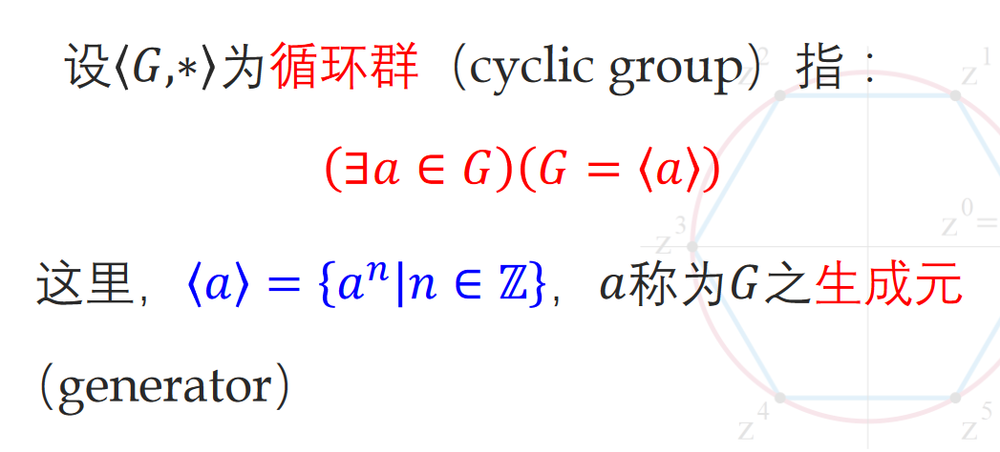
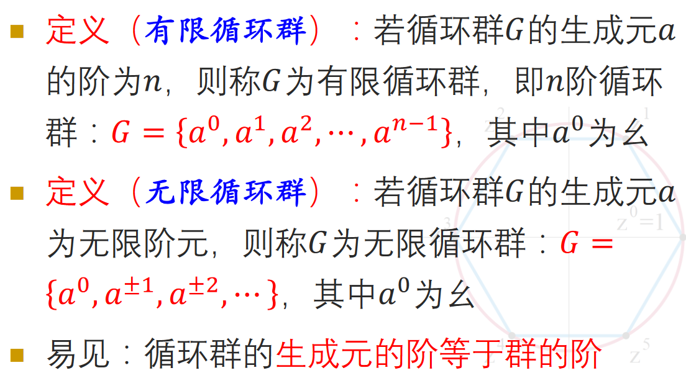
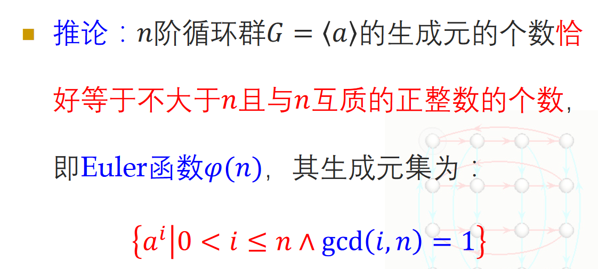
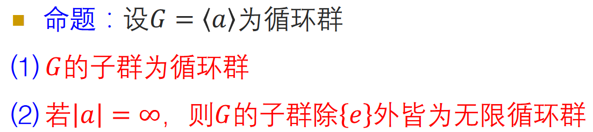
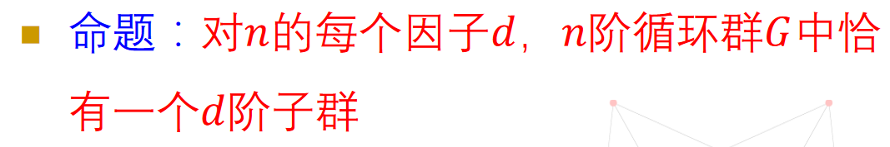
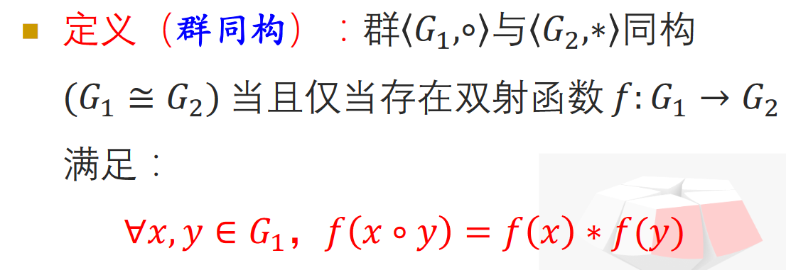
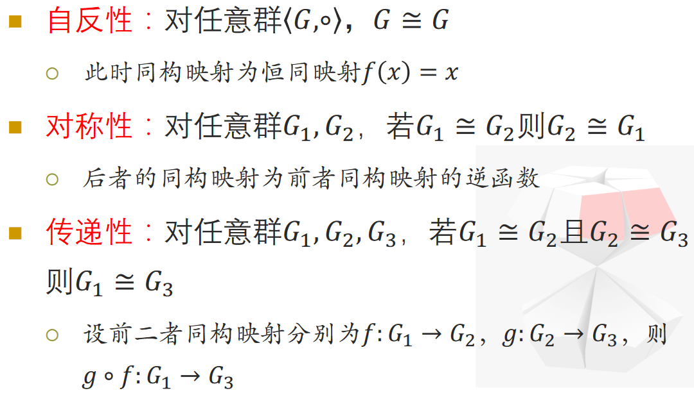
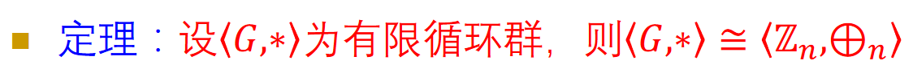
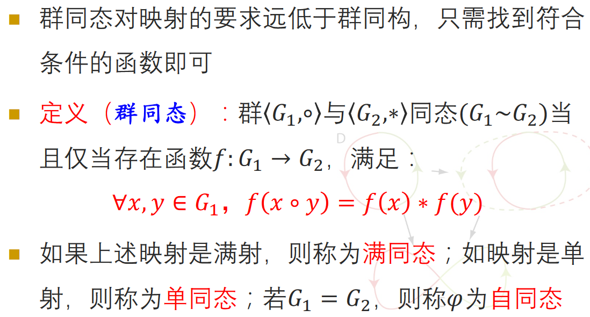
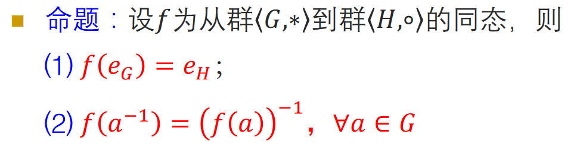

<!--
 * @Author: AlexZ33 775136985@qq.com
 * @Date: 2021-07-07 11:18:29
 * @LastEditors: AlexZ33 775136985@qq.com
 * @LastEditTime: 2022-11-07 16:03:20
 * @FilePath: /NJUAI-Notes-master/离散数学/14.md
 * @Description: 这是默认设置,请设置`customMade`, 打开koroFileHeader查看配置 进行设置: https://github.com/OBKoro1/koro1FileHeader/wiki/%E9%85%8D%E7%BD%AE
-->
#! https://zhuanlan.zhihu.com/p/581201363
# 循环群与群同构

# 循环群与生成元

## 循环群

并不是所有群都是循环群, 比如Klein四元群

## 性质

* $若𝑎是无限循环群的生成元，则𝑎^{-1}, 也是该无限循环群的生成元$
* $无限循环群有且只有2个生成元$
* $设有限群𝐺=\langle 𝑎 \rangle, 且|𝑎|=𝑛，则对任意不大于𝑛的正整数𝑟,𝐺=\langle 𝑎^r\rangle⇔gcd\langle 𝑛,r \rangle=1$

## 循环群的子群

# 群同构与同构映射

## 同构关系是等价关系

**循环群皆为阿贝尔群**

# 同态和同态映射

