<!--
 * @Author: AlexZ33 775136985@qq.com
 * @Date: 2021-07-07 11:18:29
 * @LastEditors: AlexZ33 775136985@qq.com
 * @LastEditTime: 2022-11-07 17:35:36
 * @FilePath: /NJUAI-Notes-master/离散数学/19.md
 * @Description: 这是默认设置,请设置`customMade`, 打开koroFileHeader查看配置 进行设置: https://github.com/OBKoro1/koro1FileHeader/wiki/%E9%85%8D%E7%BD%AE
-->
#! https://zhuanlan.zhihu.com/p/581243314
# 图的连通性

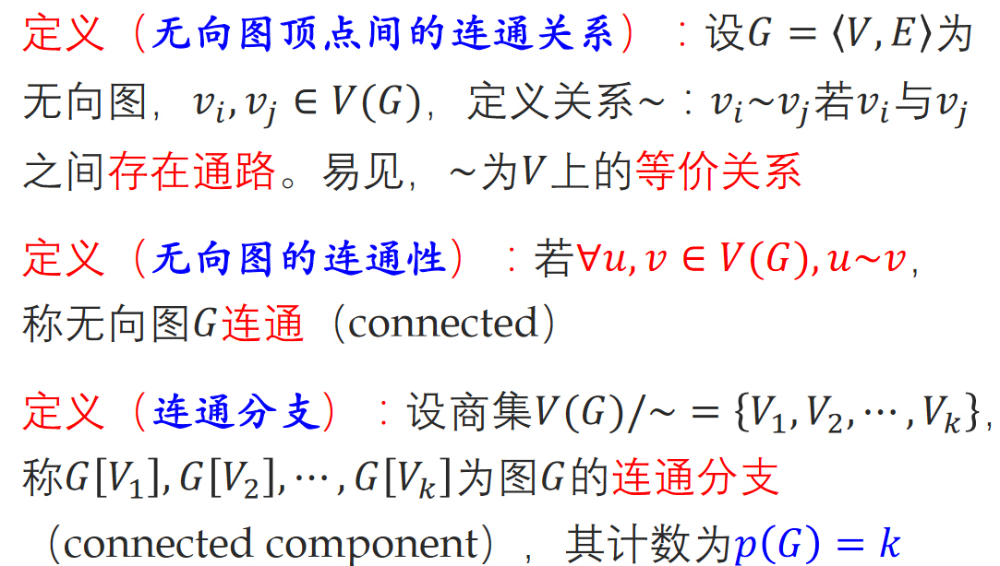

# 连通图

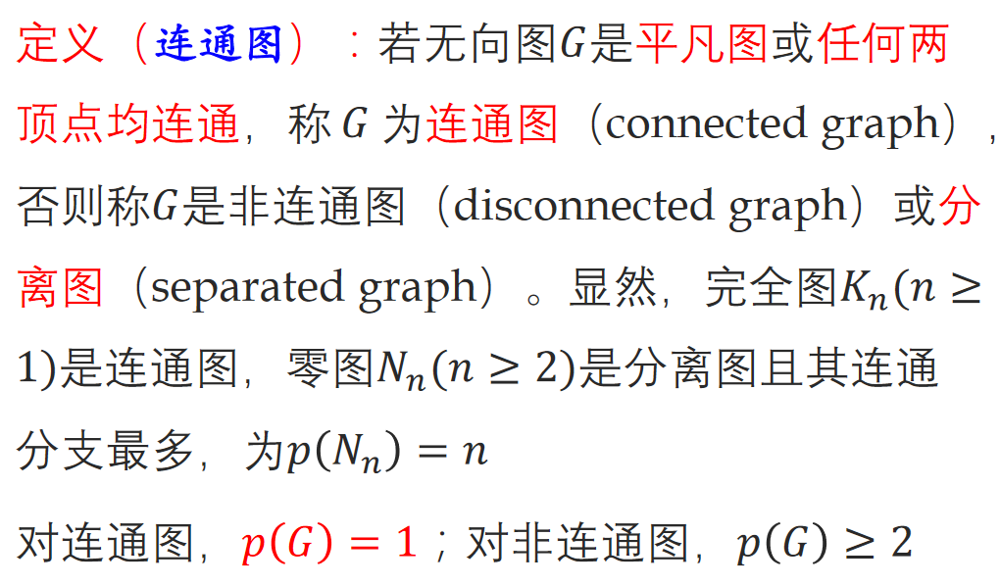

## 性质

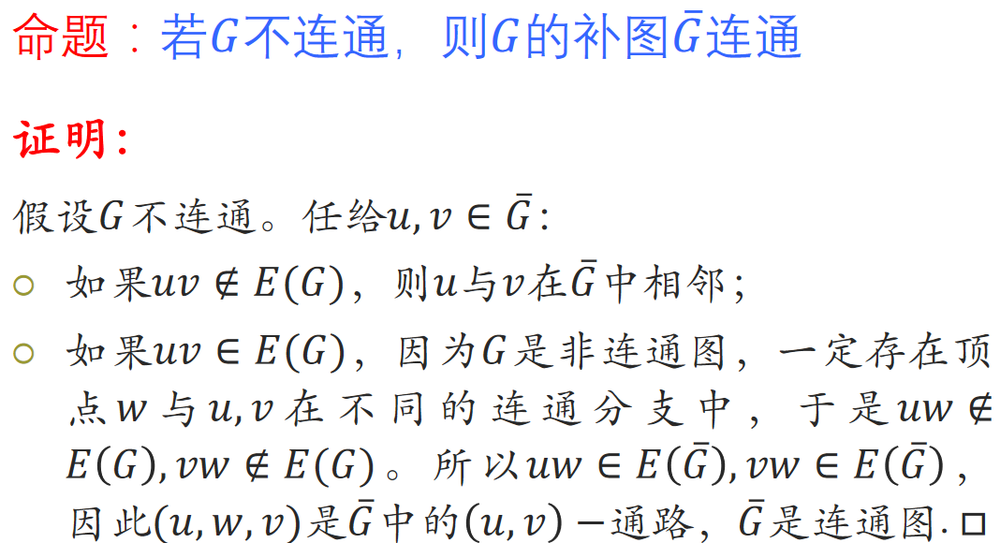

# 连通性的度量

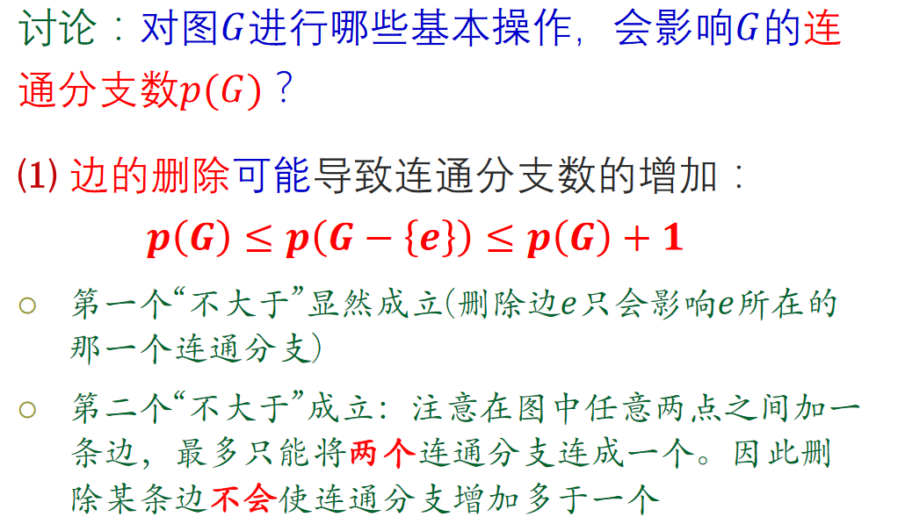

# 点割集

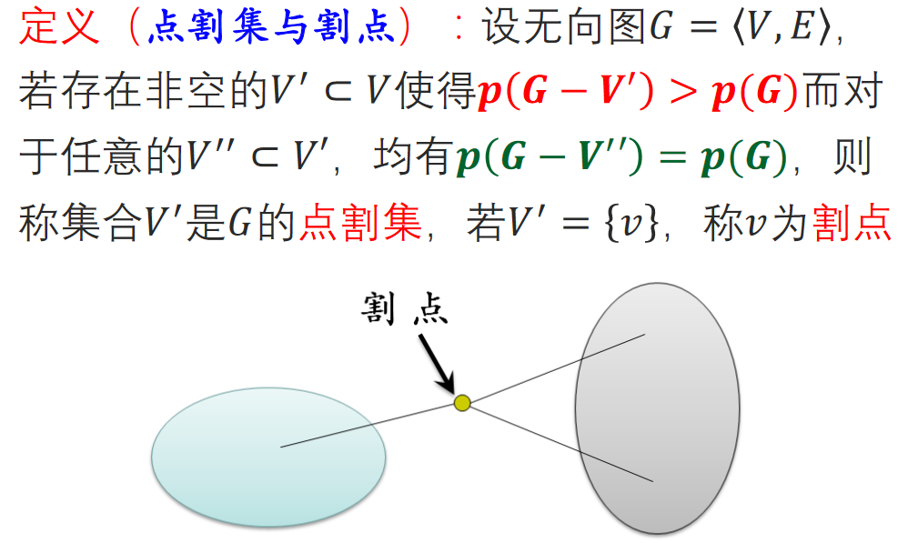

$即V'是使得图分离的最小点集合$

$如果点割集中只有一个元素, 则称为割点$

# 边割集

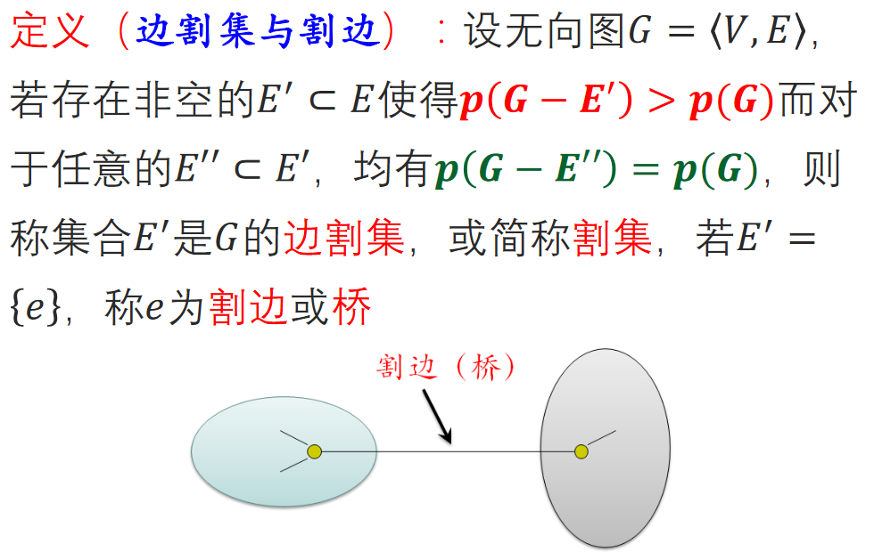

## 性质

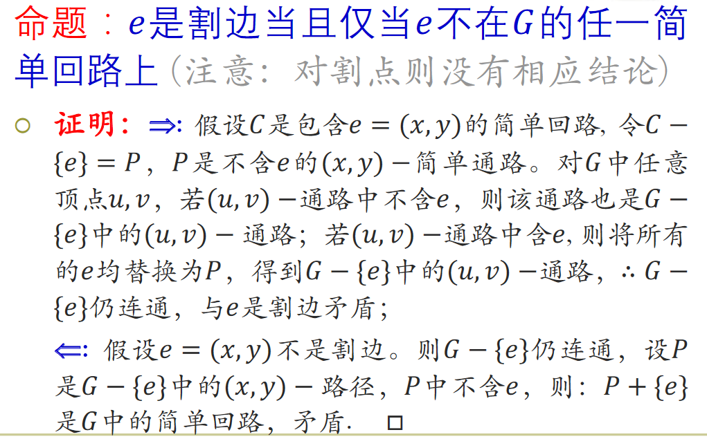

# 点连通度

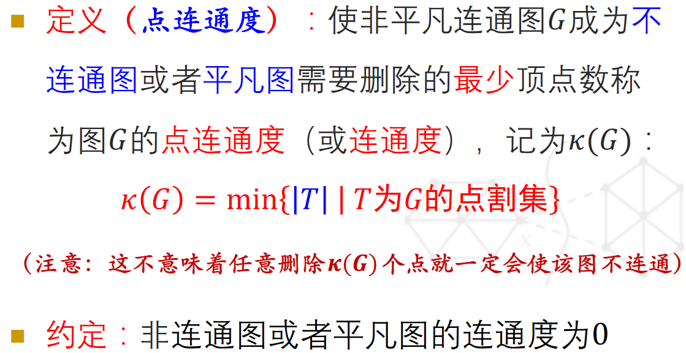

## k-点连通图 (k-连通图)

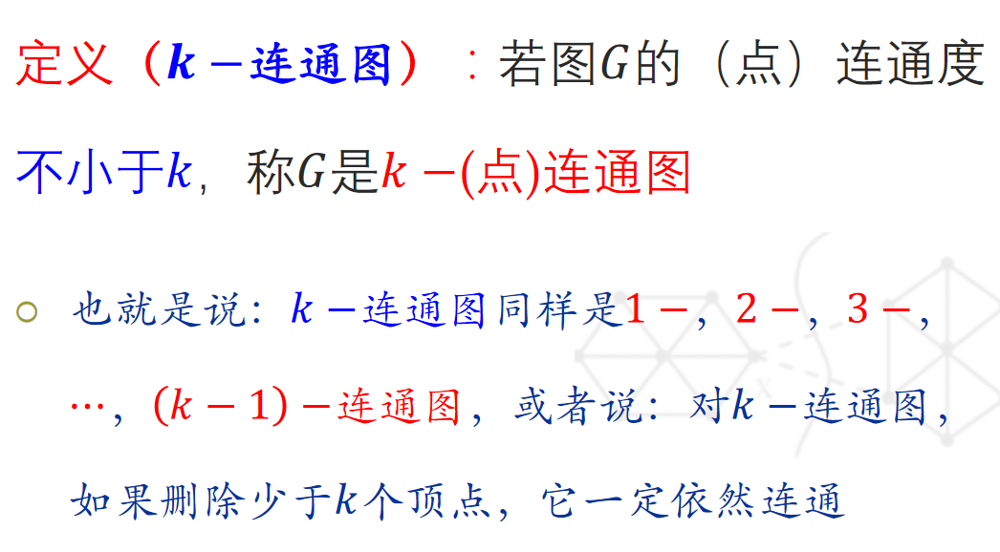

# 边连通度

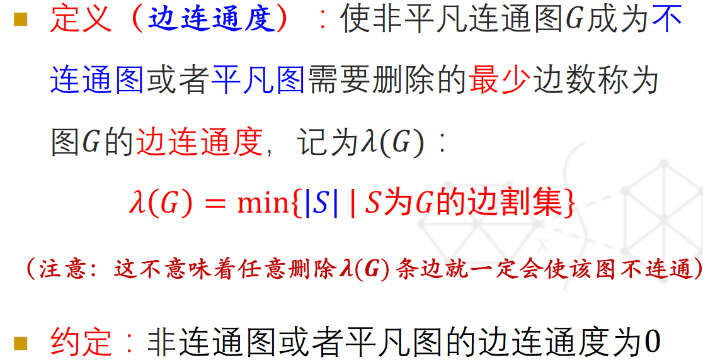

## k-边连通度

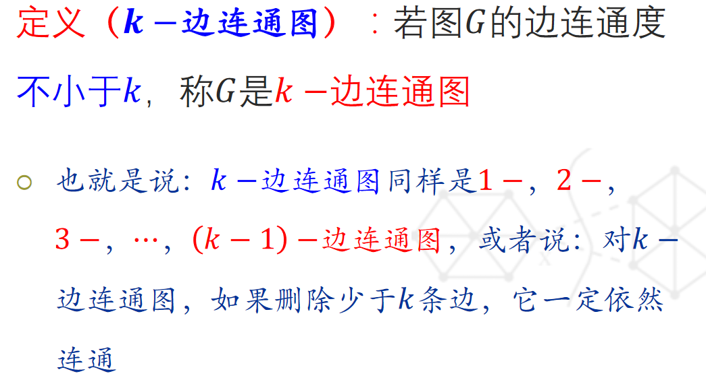

# 连通度上限

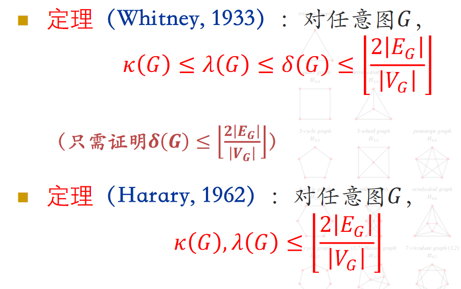

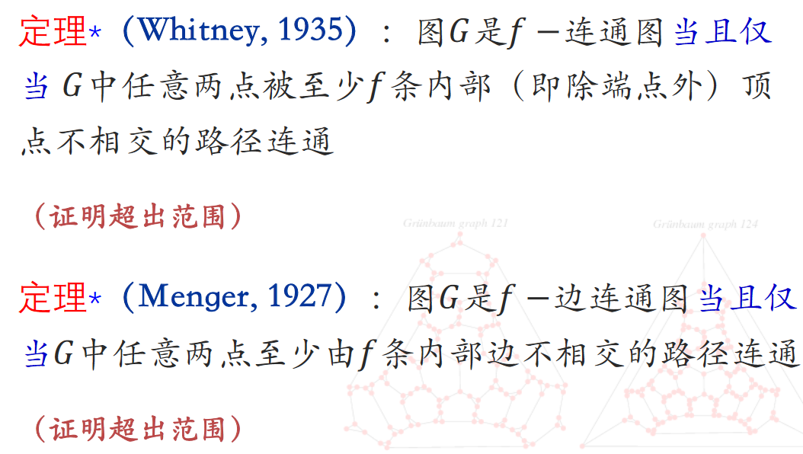

