#! https://zhuanlan.zhihu.com/p/581278871
<!--
 * @Author: AlexZ33 775136985@qq.com
 * @Date: 2021-07-07 11:18:29
 * @LastEditors: AlexZ33 775136985@qq.com
 * @LastEditTime: 2022-11-07 19:51:05
 * @FilePath: /NJUAI-Notes-master/离散数学/20.md
 * @Description: 这是默认设置,请设置`customMade`, 打开koroFileHeader查看配置 进行设置: https://github.com/OBKoro1/koro1FileHeader/wiki/%E9%85%8D%E7%BD%AE
-->
#! https://zhuanlan.zhihu.com/p/581243395
# 欧拉图和哈密顿图

## 欧拉通路和欧拉图

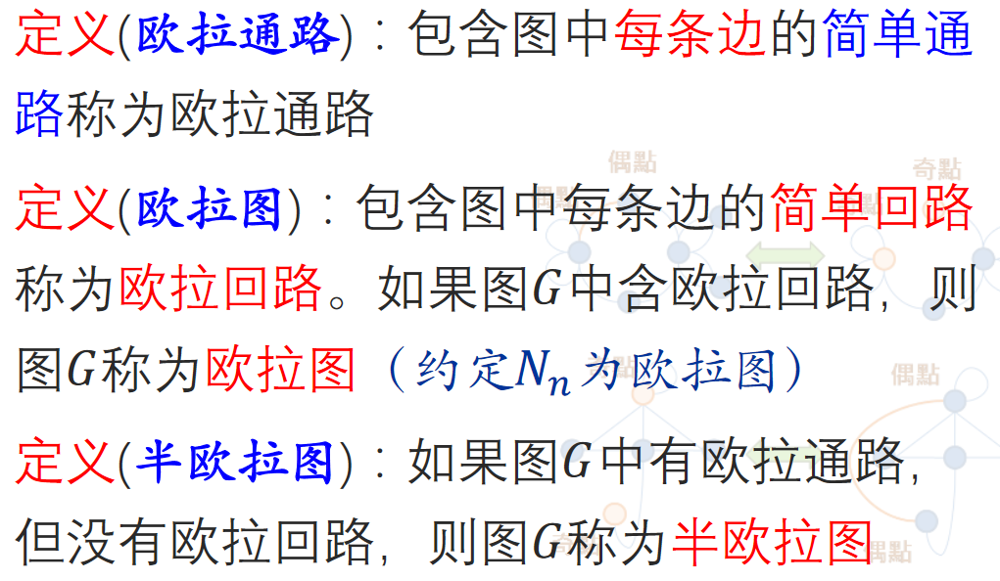

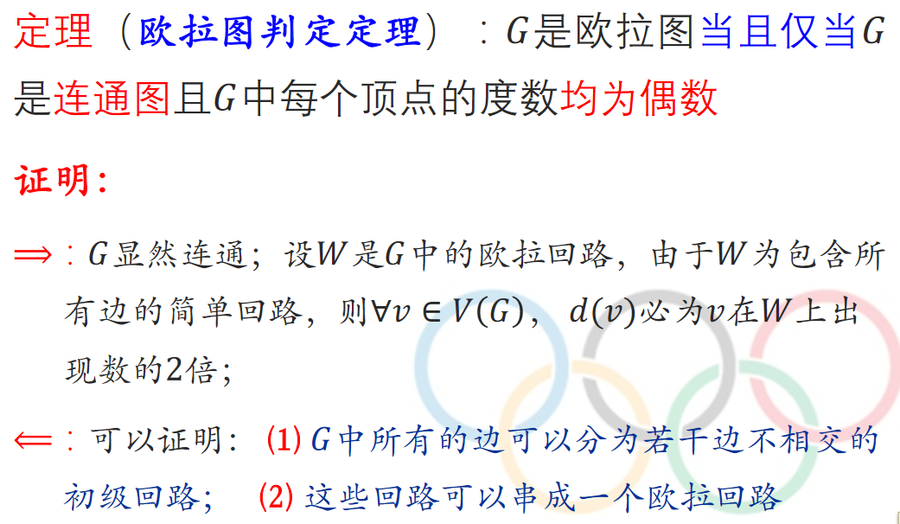

$将行列式里的负号全变成正号, 就变成了积和式, 没有高斯消元法$

$难以计算, 欧拉图也类似$

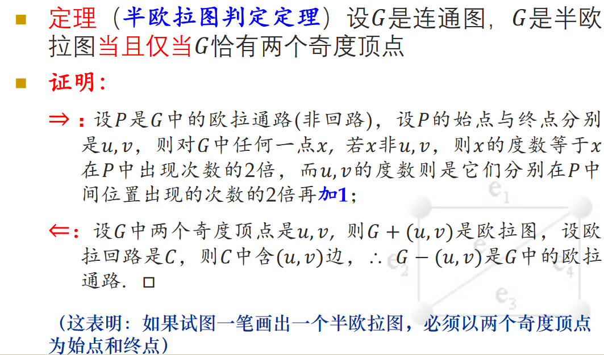

$欧拉图中无桥$

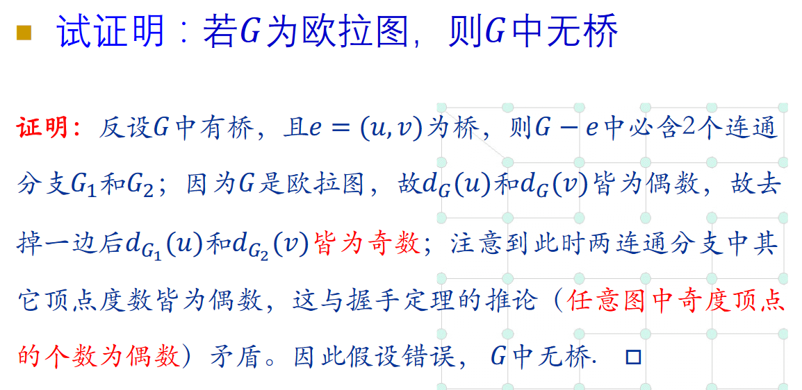

## Fleury 算法

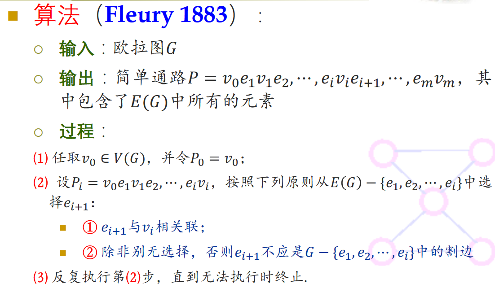

$可应用于人类基因组测序中.$

# 哈密顿回路和哈密顿图

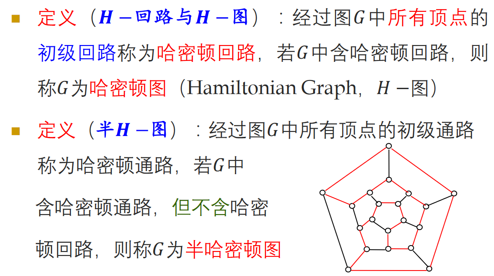

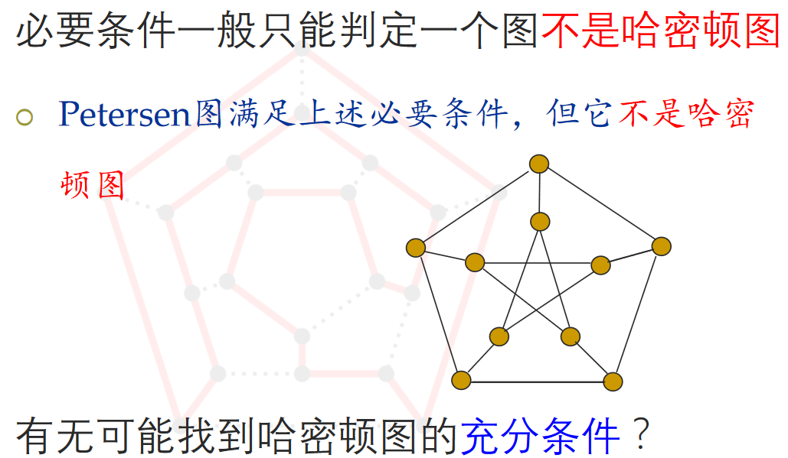

## 定点对的度数与图的连通

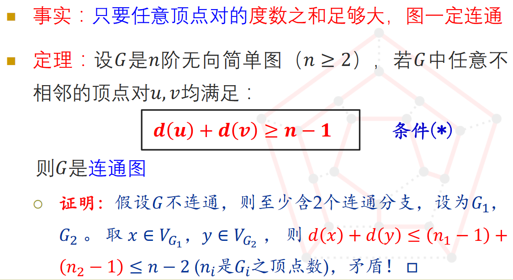

## 极大通路改造成通路

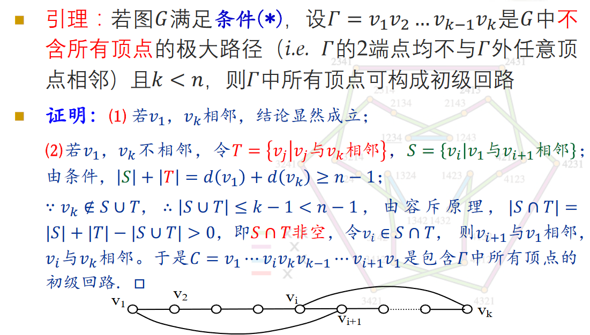

## 半哈密顿图的充分条件

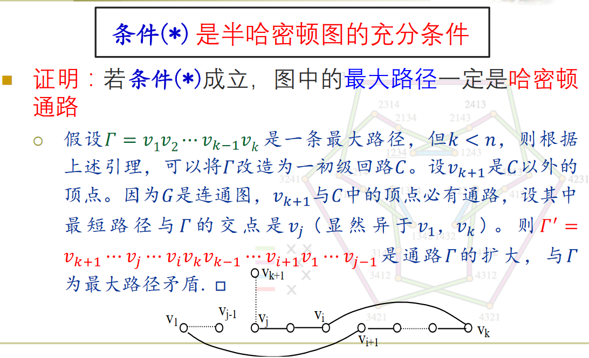

## 哈密顿图的充分条件

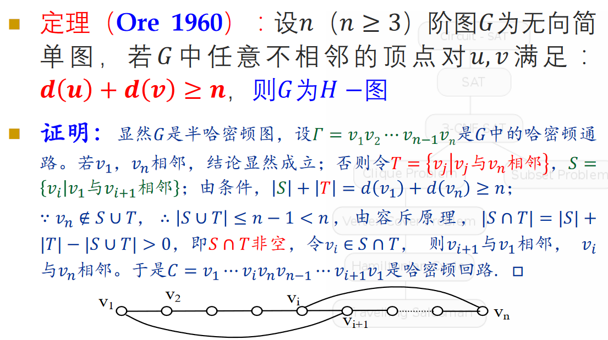

##  哈密顿图的一个充要条件

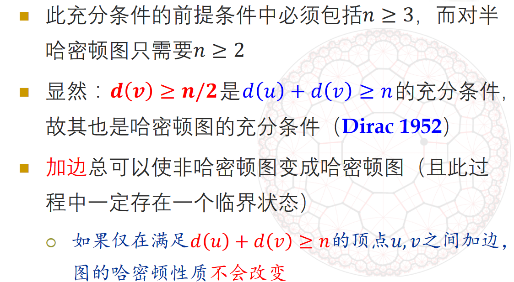

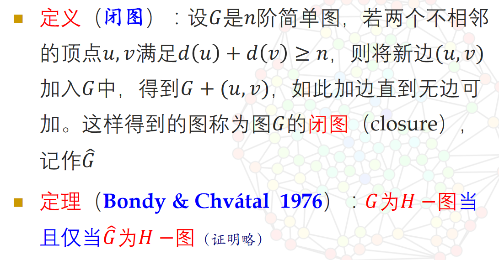

