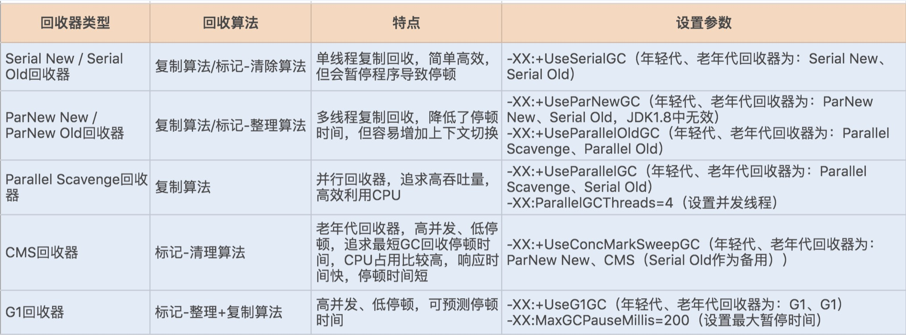

<!--
 * @Author: zhaokang zhaokang1@xiaomi.com
 * @Date: 2022-06-10 10:03:58
 * @LastEditors: zhaokang zhaokang1@xiaomi.com
 * @LastEditTime: 2022-06-10 11:01:53
 * @FilePath: /CS-notes/面试/10道题.md
 * @Description: 这是默认设置,请设置`customMade`, 打开koroFileHeader查看配置 进行设置: https://github.com/OBKoro1/koro1FileHeader/wiki/%E9%85%8D%E7%BD%AE
-->
# Java开发工程师

###  面向对象的特征有哪些方面
1) 抽象：抽象就是忽略一个主题中与当前目标无关的那些方面，以便更充分地注意与当前目标有关的方面。抽象并不打算了解全部问题，而只是选择其中的一部分，暂时不用部分细节。抽象包括两个方面，一是过程抽象，二是数据抽象。

2) 继承：继承是一种联结类的层次模型，并且允许和鼓励类的重用，它提供了一种明确表述共性的方法。对象的一个新类可以从现有的类中派生，这个过程称为类继承。新类继承了原始类的特性，新类称为原始类的派生类（子类），而原始类称为新类的基类（父类）。派生类可以从它的基类那里继承方法和实例变量，并且类可以修改或增加新的方法使之更适合特殊的需要。

3) 封装：封装是把过程和数据包围起来，对数据的访问只能通过已定义的界面。面向对象计算始于这个基本概念，即现实世界可以被描绘成一系列完全自治、封装的对象，这些对象通过一个受保护的接口访问其他对象。

4）多态性：多态性是指允许不同类的对象对同一消息作出响应。多态性包括参数化多态性和包含多态性。多态性语言具有灵活、抽象、行为共享、代码共享的优势，很好的解决了应用程序函数同名问题。


###  final有哪些用法。
> 
被final修饰的类不可以被继承。

被final修饰的方法不可以被重写 。

被final修饰的变量不可以被改变。如果修饰引用，那么表示引用不可变，引用指向的内容可变。

被final修饰的方法，JVM会尝试将其内联，以提高运行效率 。

被final修饰的常量，在编译阶段会存入常量池中。


### 什么是线程死锁？死锁如何产生？如何避免线程死锁？
产生死锁的条件：1.互斥条件：一个资源每次只能被一个进程使用。

2.请求与保持条件：一个进程因请求资源而阻塞时，对已获得的资源保持不放。

3.不剥夺条件:进程已获得的资源，在末使用完之前，不能强行剥夺。

4.循环等待条件:若干进程之间形成一种头尾相接的循环等待资源关系。

### 覆盖(Override)和重载(Overload)的区别。重载的方法能否根据返回类型进行区分？

方法的重载和重写都是实现多态的方式，区别在于前者实现的是编译时的多态性，而后者实现的是运行时的多态性。重载发生在一个类中，同名的方法如果有不同的参数列表（参数类型不同、参数个数不同或者二者都不同）则视为重载；重写发生在子类与父类之间，重写要求子类被重写方法与父类被重写方法有相同的返回类型，比父类被重写方法更好访问，不能比父类被重写方法声明更多的异常（里氏代换原则）。重载对返回类型没有特殊的要求。


###  synchronized的作用

修饰静态方法，则以类作为锁对象，同时只能有一个线程访问此类同步的静态方法；修饰普通方法，则以此对象作为锁对象，同时只能有一个线程访问此类同步的普通方法；也可以自定义锁对象同步代码块。

### JAVA语言如何进行异常处理，关键字：throws,throw,try,catch,finally分别代表什么意义？在try块中可以抛出异常吗？
Java通过面向对象的方法进行异常处理，把各种不同的异常进行分类，并提供了良好的接口。在Java中，每个异常都是一个对象，它是Throwable类或其它子类的实例。当一个方法出现异常后便抛出一个异常对象，该对象中包含有异常信息，调用这个对象的方法可以捕获到这个异常并进行处理。Java的异常处理是通过5个关键词来实现的：try、catch、throw、throws和finally。一般情况下是用try来执行一段程序，如果出现异常，系统会抛出（throws）一个异常，这时候你可以通过它的类型来捕捉（catch）它，或最后（finally）由缺省处理器来处理。

用try来指定一块预防所有“异常”的程序。紧跟在try程序后面，应包含一个catch子句来指定你想要捕捉的“异常”的类型。

throw语句用来明确地抛出一个“异常”。

throws用来标明一个成员函数可能抛出的各种“异常”。

Finally为确保一段代码不管发生什么“异常”都被执行一段代码。

可以在一个成员函数调用的外面写一个try语句，在这个成员函数内部写另一个try语句保护其他代码。每当遇到一个try语句，“异常”的框架就放到堆栈上面，直到所有的try语句都完成。如果下一级的try语句没有对某种“异常”进行处理，堆栈就会展开，直到遇到有处理这种“异常”的try语句。

### 什么是线程池（thread pool）？

在面向对象编程中，创建和销毁对象是很费时间的，因为创建一个对象要获取内存资源或者其它更多资源。在Java中更是如此，虚拟机将试图跟踪每一个对象，以便能够在对象销毁后进行垃圾回收。所以提高服务程序效率的一个手段就是尽可能减少创建和销毁对象的次数，特别是一些很耗资源的对象创建和销毁，这就是”池化资源”技术产生的原因。线程池顾名思义就是事先创建若干个可执行的线程放入一个池（容器）中，需要的时候从池中获取线程不用自行创建，使用完毕不需要销毁线程而是放回池中，从而减少创建和销毁线程对象的开销。

Java 5+中的Executor接口定义一个执行线程的工具。它的子类型即线程池接口是ExecutorService。要配置一个线程池是比较复杂的，尤其是对于线程池的原理不是很清楚的情况下，因此在工具类Executors面提供了一些静态工厂方法，生成一些常用的线程池，如下所示：

- newSingleThreadExecutor：创建一个单线程的线程池。这个线程池只有一个线程在工作，也就是相当于单线程串行执行所有任务。如果这个唯一的线程因为异常结束，那么会有一个新的线程来替代它。此线程池保证所有任务的执行顺序按照任务的提交顺序执行。

- newFixedThreadPool：创建固定大小的线程池。每次提交一个任务就创建一个线程，直到线程达到线程池的最大大小。线程池的大小一旦达到最大值就会保持不变，如果某个线程因为执行异常而结束，那么线程池会补充一个新线程。

- newCachedThreadPool：创建一个可缓存的线程池。如果线程池的大小超过了处理任务所需要的线程，那么就会回收部分空闲（60秒不执行任务）的线程，当任务数增加时，此线程池又可以智能的添加新线程来处理任务。此线程池不会对线程池大小做限制，线程池大小完全依赖于操作系统（或者说JVM）能够创建的最大线程大小。

- newScheduledThreadPool：创建一个大小无限的线程池。此线程池支持定时以及周期性执行任务的需求。

- newSingleThreadExecutor：创建一个单线程的线程池。此线程池支持定时以及周期性执行任务的需求。


  ### JDK 和 JRE 的区别？
- JDK： Java Development Kit，开发工具包。提供了编译运行 Java 程序的各种工具，包括编译器、JRE 及常用类库，是 JAVA 核心。
- JRE： Java Runtime Environment，运行时环境，运行 Java 程序的必要环境，包括 JVM、核心类库、核心配置工具。

### Java 按值调用还是引用调用？

`按值调用`：指方法接收调用提供的值
`按引用调用`：指方法接收调用者提供的变量地址

### 什么是反射？
在运行状态中，对任意一个类都能知道它的所有属性和方法，对于任意一个对象都能调用它的任意方法和属性，这种动态获取信息及调用对象方法的功能称为反射。
- 缺点：破坏封装性以及泛型约束
- 反射是框架的核心，Spring大量使用了反射

### Class 类的作用？如何获取一个 Class 对象？
在程序运行期间，Java 运行时系统为所有对象维护一个运行时类型标识，这个信息会跟踪每个对象所属的类，虚拟机利用运行时类型信息选择要执行的正确方法，保存这些信息的类就是 Class，这是一个泛型类。

获取 Class 对象：① 类名.class 。②对象的 getClass方法。③ Class.forName(类的全限定名)。

### 描述一下IOC(控制反转)原理，描述一下使用IOC容器 （spring/resin）

通过引入IOC容器，利用依赖关系注入的方式，实现对象之间的解耦。

### 多线程实现方式，sleep（）和wait（）区别。非阻塞实现是怎么做到的

java提供了两种方式，一个是继承Thread类，另一个是实现Runnable接口，由于java不支持多继承，所以在多继承的时候，我们得优先选用 实现 Runnable接口，因为我们可以通过实现接口的办法，间接的实现多继承！

这两个方法区别在于：sleep（）是Thread类的，而wait（）是Object类的，sleep是睡眠，指定时间后线程会继续执行，不放弃对cpu资源的占用（即不放弃对象锁），相当于暂停指定t，wait（）是等待，需要唤醒，它会释放对cpu资源的占用（即会放弃对象锁），调用notify（）和notifyAll（）唤醒。
Callable+Future/FutureTask

### GC回收器使用的回收算法和特点



### 简述一下生产者/消费者模式

###  消息队列实现

### 如何限流，常见的限流算法。

 令牌桶(Token Bucket)、漏桶(leaky bucket)和计数器算法是最常用的三种限流的算法。link：https://www.jianshu.com/p/d11baa736d22

###  如何实现分布式锁

 https://www.jianshu.com/p/535efcab356d

 ### String是否可被继承
 1、String是字符串常量，StringBuffer和StringBuilder都是字符串变量。后两者的字符内容可变，而前者创建后内容不可变。

2、String不可变是因为在JDK中String类被声明为一个final类。

3、StringBuffer是线程安全的，而StringBuilder是非线程安全的。

ps：线程安全会带来额外的系统开销，所以StringBuilder的效率比StringBuffer高。

### HashMap的工作原理。
  https://blog.csdn.net/uhgagnu/article/details/54982960

考察扩容机制。

哈希表及处理hash冲突的方法。

是否线程安全，怎么保证线程安全。


### HashMap和Hashtable的区别： 

HashMap把Hashtable的contains方法去掉了，改成containsvalue和containsKey。因为contains方法容易让人引起误解。 
一.历史原因:Hashtable是基于陈旧的Dictionary类的，HashMap是Java 1.2引进的Map接口的一个实现 
二.同步性:Hashtable是线程安全的，也就是说是同步的，而HashMap是线程序不安全的，不是同步的 
三.值：只有HashMap可以让你将空值作为一个表的条目的key或value，即HashMap允许将null作为一个entry的key或者value，而Hashtable不允许

### ArrayList和Vector的区别：
共同点：这两个类都实现了List接口（List接口继承了Collection接口），他们都是有序集合，即存储在这两个集合中的元素的位置都是有顺序的，相当于一种动态的数组，我们以后可以按位置索引号取出某个元素，并且其中的数据是允许重复的，这是与HashSet之类的集合的最大不同处，HashSet之类的集合不可以按索引号去检索其中的元素，也不允许有重复的元素。 
接着说ArrayList与Vector的区别，这主要包括两个方面：. 
同步性：Vector是线程安全的，也就是说是它的方法之间是线程同步的，而ArrayList是线程序不安全的，它的方法之间是线程不同步的。如果只有一个线程会访问到集合，那最好是使用ArrayList，因为它不考虑线程安全，效率会高些；如果有多个线程会访问到集合，那最好是使用Vector，因为不需要我们自己再去考虑和编写线程安全的代码。 
注意：这里谈到线程安全，同步问题，面试官少不了会多嘴说一句，让你讲讲线程安全是咋回事，如果不考虑，你听到这个问题估计会是一脸懵逼，我当初就是这样子的！所以这里我补充下线程安全的问题： java中的线程安全就是线程同步的意思，就是当一个程序对一个线程安全的方法或者变量进行访问的时候，其他的程序不能再对他进行操作了，必须等到这次访问结束以后才能对这个线程安全的方法进行访问，否则将会造成错误发生；线程安全就是说，如果你的代码所在的进程中有多个线程在同时运行，而这些线程可能会同时运行这段代码。如果每次运行结果和单线程运行的结果是一样的，而且其他的变量的值也和预期的是一样的，就是线程安全的。 线程安全问题都是由全局变量及静态变量引起的，定义在方法内部的局部私有变量是没有线程安全与否一说的。 
备注：对于Vector&ArrayList、Hashtable&HashMap，要记住线程安全的问题，记住Vector与Hashtable是旧的，是java一诞生就提供了的，它们是线程安全的，ArrayList与HashMap是java2时才提供的，它们是线程不安全的。所以，我们讲课时先讲老的。 
数据增长：ArrayList与Vector都有一个初始的容量大小，当存储进它们里面的元素的个数超过了容量时，就需要增加ArrayList与Vector的存储空间，每次要增加存储空间时，不是只增加一个存储单元，而是增加多个存储单元，每次增加的存储单元的个数在内存空间利用与程序效率之间要取得一定的平衡。Vector默认增长为原来两倍，而ArrayList的增长策略在文档中没有明确规定（从源代码看到的是增长为原来的1.5倍）。ArrayList与Vector都可以设置初始的空间大小，Vector还可以设置增长的空间大小，而ArrayList没有提供设置增长空间的方法。

### HashMap的数据结构是什么样的?
应该说出1.7和1.8的区别，延伸到红黑树，为什么使用红黑树。可以关联到mysql索引，mysql索引用的是什么数据结构。B+树的优点是啥/

### HashMap如何扩容？


### 类加载与双亲委派机制？

###  java的数据类型？


###  java的内存模型


### Java虚拟机垃圾回收算法？


###  redis是什么，介绍下它的优点？


### redis的五种数据类型

### 缓存雪崩，穿透，击穿分别是什么，分别如何解决


### redis为什么这么快

### redis的持久化机制的两种方式

### 如何实现分布式锁？redis，mysql，zookeeper

# Web前端工程师

###  实现一个函数筛选出客户1290所有的消费数据：即将下面的数据data转换成push输出


```javascript
const mydata =  [
    {
        "20181202": [
            {
                "data": "1200",
                "peopleId": "1290"
            },
            {
                "data": "7887",
                "peopleId": "1290"
            }
        ]
    },
    {
        "20190730": [
            {
                "data": "8889",
                "people": "1290"
            },
            {
                "data": "9889",
                "peopleId": "1230"
            }
        ]
    }
]
```

```javascript
function dataFormat(data, peopleId) { 
//筛选出客户1290所有的消费数据 
}
```
```javascript
let push = [
    {
        "time": "2018-12-02",
        "data": "1200"
    },
    {
        "time": "2018-12-02",
        "data": "7887"
    },
    {
        "time": "2019-07-30",
        "data": "8889"
    }
]
```

###  margin重叠

margin重叠算是前端开发比较容易被忽视的一个点,这里强调一点做垂直居中的时候千万不要用margin去做定位完成，不然极有可能引来一系列问题。
先做个总结margin重叠仅存在于垂直方向，水平方向不存在重叠。也就是说只有在没有浮动的块标签(display:block)中会出现margin重叠,

### commonjs与es6 module的区别
commonJs 是被加载的时候运行，esModule 是编译的时候运行 commonJs 输出的是值的浅拷贝，esModule 输出值的引用 webpack 中的 webpack_require 对他们处理方式不同 webpack 的按需加载实现

###  vue   v-show 与v-if有什么区别
v-if 是真正的条件渲染，因为它会确保在切换过程中条件块内的事件监听器和子组件适当地被销毁和重建；也是惰性的：如果在初始渲染时条件为假，则什么也不做——直到条件第一次变为真时，才会开始渲染条件块。
v-show 就简单得多——不管初始条件是什么，元素总是会被渲染，并且只是简单地基于 CSS 的 “display” 属性进行切换。
所以，v-if 适用于在运行时很少改变条件，不需要频繁切换条件的场景；v-show 则适用于需要非常频繁切换条件的场景。

### react render props是用来干嘛的？

###  vue computed和watch的区别和运用场景， 他们是怎样实现的

computed： 是计算属性，依赖其它属性值，并且 computed 的值有缓存，只有它依赖的属性值发生改变，下一次获取 computed 的值时才会重新计算 computed 的值；
watch： 更多的是「观察」的作用，类似于某些数据的监听回调 ，每当监听的数据变化时都会执行回调进行后续操作；
运用场景：
当我们需要进行数值计算，并且依赖于其它数据时，应该使用 computed，因为可以利用 computed 的缓存特性，避免每次获取值时，都要重新计算；
当我们需要在数据变化时执行异步或开销较大的操作时，应该使用 watch，使用 watch 选项允许我们执行异步操作 ( 访问一个 API )，限制我们执行该操作的频率，并在我们得到最终结果前，设置中间状态。这些都是计算属性无法做到的。


### Typescript  泛型有什么用途？

### 什么是闭包？有哪些应用场景

1）什么是闭包
函数执行后返回结果是一个内部函数，并被外部变量所引用，如果内部函数持有被执行函数作用域的变量，即形成了闭包。

可以在内部函数访问到外部函数作用域。使用闭包，一可以读取函数中的变量，二可以将函数中的变量存储在内存中，保护变量不被污染。而正因闭包会把函数中的变量值存储在内存中，会对内存有消耗，所以不能滥用闭包，否则会影响网页性能，造成内存泄漏。当不需要使用闭包时，要及时释放内存，可将内层函数对象的变量赋值为null。

2）闭包原理
函数执行分成两个阶段(预编译阶段和执行阶段)。

在预编译阶段，如果发现内部函数使用了外部函数的变量，则会在内存中创建一个“闭包”对象并保存对应变量值，如果已存在“闭包”，则只需要增加对应属性值即可。
执行完后，函数执行上下文会被销毁，函数对“闭包”对象的引用也会被销毁，但其内部函数还持用该“闭包”的引用，所以内部函数可以继续使用“外部函数”中的变量
利用了函数作用域链的特性，一个函数内部定义的函数会将包含外部函数的活动对象添加到它的作用域链中，函数执行完毕，其执行作用域链销毁，但因内部函数的作用域链仍然在引用这个活动对象，所以其活动对象不会被销毁，直到内部函数被烧毁后才被销毁。

3）优点
可以从内部函数访问外部函数的作用域中的变量，且访问到的变量长期驻扎在内存中，可供之后使用
避免变量污染全局
把变量存到独立的作用域，作为私有成员存在
4）缺点
对内存消耗有负面影响。因内部函数保存了对外部变量的引用，导致无法被垃圾回收，增大内存使用量，所以使用不当会导致内存泄漏
对处理速度具有负面影响。闭包的层级决定了引用的外部变量在查找时经过的作用域链长度
可能获取到意外的值(captured value)
5）应用场景
应用场景一： 典型应用是模块封装，在各模块规范出现之前，都是用这样的方式防止变量污染全局。

````
var Yideng = (function () {
    // 这样声明为模块私有变量，外界无法直接访问
    var foo = 0;

    function Yideng() {}
    Yideng.prototype.bar = function bar() {
        return foo;
    };
    return Yideng;
}());	
````

	
应用场景二： 在循环中创建闭包，防止取到意外的值。

如下代码，无论哪个元素触发事件，都会弹出 3。因为函数执行后引用的 i 是同一个，而 i 在循环结束后就是 3

```javascript
for (var i = 0; i < 3; i++) {
    document.getElementById('id' + i).onfocus = function() {
      alert(i);
    };
}
//可用闭包解决
function makeCallback(num) {
  return function() {
    alert(num);
  };
}
for (var i = 0; i < 3; i++) {
    document.getElementById('id' + i).onfocus = makeCallback(i);
}
```

### 浏览器的主要组成部分是什么？

「用户界面」 – 包括地址栏、前进/后退按钮、书签菜单等。
「浏览器引擎」 – 在用户界面和呈现引擎之间传送指令。
「呈现引擎」 – 负责显示请求的内容。如果请求的内容是 HTML，它就负责解析 HTML 和 CSS 内容，并将解析后的内容显示在屏幕上。
「网络」 – 用于网络调用，比如 HTTP 请求。
「用户界面后端」 -用于绘制基本的窗口小部件，比如组合框和窗口。
「JavaScript 解释器」– 用于解析和执行 JavaScript 代码。
「数据存储」 – 这是持久层。浏览器需要在硬盘上保存各种数据，例如 Cookie。新的 HTML 规范 (HTML5) 定义了“网络数据库”，这是一个完整（但是轻便）的浏览器内数据库。
值得注意的是，和大多数浏览器不同，Chrome 浏览器的每个标签页都分别对应一个呈现引擎实例。每个标签页都是一个独立的进程。

### 开发中有哪些原因会引起内存泄漏，应该如何避免

```
1、意外的全局变量
2、闭包引起的内存泄漏
3、没有清理的 DOM 元素引用
4、被遗忘的定时器或者回调
```
ES6的两种新的数据结构： weakset 和 weakmap 。他们对值的引用都是不计入垃圾回收机制的


### nodejs服务中，如何删除一个已经设置的cookie？
为什么需要cookie，cookie有什么特性，nodejs+koa中如果删除一个已经存在的cookie
```
ctx.cookies.set('vid', '', { maxAge: 0 });
```

### 从输入URL到页面加载发生了什么

```
DNS解析
TCP连接
发送HTTP请求
服务器处理请求并返回HTTP报文
浏览器解析渲染页面
连接结束
```

# 应用运维工程师

# 软件开发工程师

# 测试工程师

# 工业设计师

# 硬件工程师

# 电气工程师

# 机械工程师

# 研发工程师

# 设备工程师

# 嵌入式硬件工程师

# 市场研究工程师

# 机械设计工程师

# 电子工程师

# 研发工程师

# 软件开发工程师

# 总经理助理

# 策略研究员

# 设计师

# 数据中心运维

# 技术支持岗位(云服务、系统集成、硬件、数据中心)

# 研发电子工程师

# 视觉解决方案工程师

# 图形算法工程师

# 自动驾驶测试标定员

# 产品经理

# IC版图工程师

# 模拟IC设计师

# 芯片应用工程师

# 失效分析工程师

# 毫米波雷达总体设计师

# 融合算法主任工程师

# 仿真工程师

